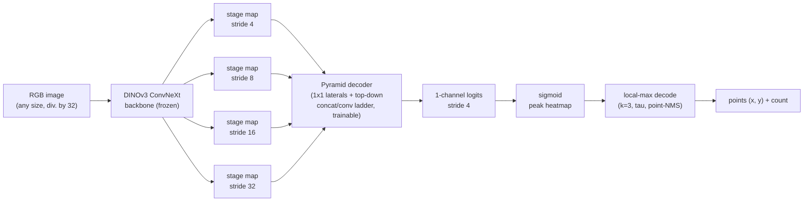

# cropcounter

Crop emergence counting from proximal RGB imagery — a frozen DINOv3 ConvNeXt
backbone, a pyramid decoder, and a stride-4 point heatmap decoded to
per-plant coordinates and a count.

The count flows *through* located points — "N because there's one there and
one there" — not through a density integral a model can fudge.
Localization is a diagnostic requirement, not just a product one: what
matters is producing as many predictions as there are plants, near their
true locations.

This repo ships with a **wheat emergence counter** as the worked example
(labels `Wheat` / `Volunteer`, example dataset, config, baseline numbers).
The package itself is crop-agnostic — point in a different `fmt="cvat"` /
`fmt="coco"` dataset with your own labels and `cropcounter.train` trains a
counter for whatever you've annotated.

## What it does

Given a top-down RGB image (a quadrat photo, a field-scout crop, anything
with visible individual plants), `cropcounter`:

1. Runs it through a **frozen** DINOv3 ConvNeXt backbone to get four
   multi-scale feature maps.
2. Fuses them with a small trainable **pyramid decoder** into a single
   stride-4 probability heatmap — one peak per plant.
3. **Decodes** that heatmap into discrete `(x, y)` points via a local-max
   test, a score threshold, and greedy non-maximum suppression.
4. Returns the points and their count.

Only the decoder trains (~3.4M parameters); the backbone's ImageNet/web-scale
pretraining does the heavy lifting on texture and shape, so the counter
reaches usable accuracy from a few thousand point-annotated images rather
than the hundreds of thousands a from-scratch detector would need.

## How it works



- **Backbone — DINOv3 ConvNeXt, frozen.** Chosen over a ViT backbone because
  it's hierarchical (genuine stride-4/8/16/32 stage maps, so the decoder gets
  real multi-scale skips) and fully convolutional (no positional embeddings,
  so it trains on fixed-size tiles and runs inference on any size divisible
  by 32). `backbone="base"` is the default; `"small"` and `"large"` are also
  available — see [`weights.py`](src/cropcounter/weights.py).
- **Decoder — a pyramid decoder**, not a textbook U-Net or FPN: uniform-width
  1×1 lateral projections and a single fine-scale output are FPN traits;
  merging each upsample step by *concatenation* + a double
  Conv→GroupNorm→GELU block (rather than add + smooth) is a U-Net trait. See
  [`dinov3_pyramid.py`](src/cropcounter/dinov3_pyramid.py).
- **Targets are peak-normalised Gaussians composed with element-wise max**,
  never summed — sum merges two nearby plants into one taller blob no peak
  detector can split; max keeps two close points as two distinct maxima with
  a saddle between them. See [`heatmap.py`](src/cropcounter/heatmap.py).
- **Decoding** is a max-pool(k) local-max test, a score threshold `tau`
  swept on validation *after* training (never fixed a priori), and a greedy
  point-NMS that kills duplicate/plateau ties. See
  [`heatmap.py`](src/cropcounter/heatmap.py).
- **Loss** is a penalty-reduced focal loss (CenterNet-style) on the raw
  logits, normalised by the number of peaks. See
  [`losses.py`](src/cropcounter/losses.py).
- **Metrics** report counting quality (MAE/RMSE/bias) and localization
  quality (Hungarian-matched precision/recall/F1 within a pixel radius)
  separately — a good count with poor localization means compensating
  errors, not a good model. See [`metrics.py`](src/cropcounter/metrics.py).

## Install

Requires Python 3.12+.

### macOS (Apple Silicon / MPS)

```bash
conda create -n crop-counter python=3.12
conda activate crop-counter
pip install -e ".[portal]"
```

The default PyPI wheels ship MPS-capable PyTorch on macOS, so nothing extra
is needed — `resolve_device()` picks `mps` over `cpu` automatically (the
backbone is frozen, so only the decoder trains; Apple Silicon is a
first-class target here, not a fallback). This exact pin combination is
verified working: `torch==2.13.0` / `torchvision==0.28.0` on macOS arm64,
Python 3.12 — see [`requirements-lock.txt`](requirements-lock.txt) for the
full frozen environment.

### Linux / Windows (NVIDIA GPU / CUDA)

Install the CUDA build of PyTorch **first**, from PyTorch's own index, then
install the package — pip won't replace an already-satisfying `torch` with
the plain-PyPI (CPU) build:

```bash
conda create -n crop-counter python=3.12
conda activate crop-counter
pip install torch torchvision --index-url https://download.pytorch.org/whl/cu124
pip install -e ".[portal]"
```

Pick the `cuXXX` index matching your driver/CUDA version from
<https://pytorch.org/get-started/locally/> — `cu124` above is an example,
not a requirement.

### Optional extras

- `.[portal]` — the hosted InsightML portal API client (`requests`,
  `python-dotenv`); see [Portal API client](#portal-api-client) below.
- `.[formats]` — the optional Datumaro annotation-format adapter; see
  [Annotation formats](#annotation-formats) below.
- `.[dev]` — `pytest`, `ruff`, `nbstripout` for local development; see
  [CONTRIBUTING.md](CONTRIBUTING.md).

## DINOv3 backbone weights

The DINOv3 ConvNeXt backbone checkpoints are a **gated download from Meta** —
they are not on PyPI and not distributed in this repository, and nothing in
this package ever fetches them for you.

1. Request access and download the **web-pretrained (LVD-1689M) ConvNeXt**
   checkpoints — not the SAT-493M satellite-imagery weights, which are a
   different ground-sample-distance regime and ViT-only — from
   <https://ai.meta.com/resources/models-and-libraries/dinov3-downloads/>.
2. Put the `.pth` file(s) in a `weights/` directory next to where you run
   from (or point `$CROPCOUNTER_WEIGHTS_DIR` at wherever they live, or pass
   `weights_dir=...` explicitly to `CropCounter` / `load_checkpoint`).

Expected filenames:

| Size | Filename |
|---|---|
| `small` | `dinov3_convnext_small_pretrain_lvd1689m-296db49d.pth` |
| `base`  | `dinov3_convnext_base_pretrain_lvd1689m-801f2ba9.pth`  |
| `large` | `dinov3_convnext_large_pretrain_lvd1689m-61fa432d.pth` |

Run `python -m cropcounter.weights [--size base] [--weights-dir DIR]` to
check where the package will look, or to get these instructions again with
the exact paths it searched.

The first backbone load also fetches Meta's DINOv3 hub **code** from GitHub
via `torch.hub` (one network round trip, then cached under
`~/.cache/torch/hub`; the package passes `trust_repo=True` so it never stops
on an interactive confirmation prompt) — the **weights** stay a manual gated
download you do yourself.

## Quickstart: count with the shipped checkpoint

The fastest runnable path — no training. `weights/decoder_best.pt` is the
trained decoder this repo ships (50-epoch run, provenance and metrics in
[`weights/README.md`](weights/README.md)); pair it with the gated DINOv3
backbone from the section above and count the bundled sample images:

```python
import torch
from cropcounter import (
    CropTileDataset, load_checkpoint, records_from_folder, predict_prob, decode_in_bounds,
)

device = torch.device("cpu")  # or "mps" / "cuda"
model, cfg = load_checkpoint("weights/decoder_best.pt", device, weights_dir="weights")
model.eval()

records = records_from_folder("examples/data/val/images")
val_ds = CropTileDataset(records, "examples/data/val/images", train=False,
                          output_stride=cfg.output_stride)

for record, item in zip(records, val_ds):
    prob = predict_prob(model, item["image"], device)
    points, scores = decode_in_bounds(
        prob, record.width, record.height, tau=0.35,
        k=cfg.k, nms_radius=cfg.nms_radius, output_stride=cfg.output_stride,
    )
    print(f"{record.name}: {len(points)} plants")
```

`tau` = 0.35 is deliberate: the checkpoint's stored config keeps the
training-time default of 0.3, but 0.35 is the swept/calibrated threshold for
these shipped weights (8.59 vs 13.83 val MAE — see
[`weights/README.md`](weights/README.md)).

## Quickstart: train your own + run inference

`examples/data` ships a small, anonymised 20-image wheat dataset
(14 train / 6 val — see [`examples/README.md`](examples/README.md)) laid out
the way `load_splits` expects, plus
[`examples/config_13ep.json`](examples/config_13ep.json), a short 13-epoch
config for a quick end-to-end run.

```bash
python -m cropcounter.train --config examples/config_13ep.json \
    --data-root examples/data --weights-dir weights --out-dir runs
```

`--device cpu|mps|cuda`, `--epochs`, and `--run-name` are also available as
CLI overrides — see `python -m cropcounter.train --help`. This writes
`runs/<run_name>/{best.pt,last.pt,history.json,curves.png}`.

Then run inference with the trained checkpoint: exactly the quickstart code
above, with your run's checkpoint in place of the shipped one —

```python
model, cfg = load_checkpoint("runs/<run_name>/best.pt", device, weights_dir="weights")
```

Calibrate `tau` for your own run with `sweep_tau` after training rather than
inheriting 0.35 — `cfg.tau` = 0.3 is a fixed per-epoch comparability setting,
not a calibrated threshold (0.35 is what the sweep picked for the shipped
weights).

`load_checkpoint`'s `weights_dir=` override matters if you run this from a
different working directory than training used — the checkpoint stores the
training-time path, which won't exist elsewhere. See
[`notebooks/training.ipynb`](notebooks/training.ipynb) and
[`notebooks/inference.ipynb`](notebooks/inference.ipynb) for the same flow
worked through interactively, including visualisation.

## Annotation formats

Every loader below emits identical `ImageRecord` / `Point` objects
(`cropcounter.crop_dataset.ImageRecord`, `.Point`), so which format your
annotation tool exports doesn't affect anything downstream.

### CVAT for images 1.1

The built-in default (`fmt="cvat"`). Minimal spec — one `<image>` per
picture, one `<points>` element per plant (or per group of plants sharing a
label), with `Wheat` / `Volunteer` as this repo's two counted labels
(pass your own `labels=(...)` tuple, or `labels=None` to keep every label):

```xml
<annotations>
  <version>1.1</version>
  <image id="0" name="q0001.jpg" width="1665" height="1810">
    <points label="Wheat" occluded="0" points="386.59,1480.11;123.99,1399.57">
      <attribute name="Confidence">92</attribute>
      <attribute name="Label Status">Correct</attribute>
    </points>
    <points label="Volunteer" occluded="0" points="756.78,311.27" />
  </image>
</annotations>
```

`points="x,y;x,y;..."` packs multiple plants of the same label into one
element (as CVAT's own exporter does); each pair becomes a separate `Point`.
`Confidence` (0-100) and `Label Status` are optional per-point QC attributes,
carried through into `Point.confidence` / `Point.label_status` for later
filtering or stratified evaluation — neither is required.

```python
from cropcounter import load_records, load_splits

records = load_records("path/to/annotations.xml")            # one file
train_records, val_records = load_splits("path/to/dataset")  # train/ + val/
```

### COCO keypoints

`fmt="coco"` reads a plain COCO **keypoints** JSON (no `pycocotools`
dependency) — categories become labels, each visible `(x, y, v)` triple
becomes a `Point`, and `attributes.Confidence` / `attributes."Label Status"`
round-trip the same way as CVAT's when the exporter wrote them:

```python
records = load_records("path/to/annotations.json", fmt="coco")
```

### Other formats via Datumaro

`fmt="datumaro"` (needs `pip install "cropcounter[formats]"`) wraps
[Datumaro](https://github.com/openvinotoolkit/datumaro), so any format
Datumaro can read converts into the same `ImageRecord`/`Point` objects —
useful for label formats without a built-in loader here (Pascal VOC,
LabelMe, YOLO, etc.).

## Results

| Run | Epochs | val count-MAE | val F1 | Held-out images | Notes |
|---|---|---|---|---|---|
| Baseline (`20260813_113733`) | 50 | 8.59 | 0.729 | 122 | `tau` swept on validation after training |
| This package (`20260818_200723`) | 13 | **8.64** | **0.726** | 122 | `tau` swept the same way; best at `tau` = 0.35 |
| This package (`20260818_200723`) | 13 | 12.27 | 0.721 | 122 | same checkpoint read at the fixed training `tau` = 0.3 |

The 13-epoch run is this package training the baseline's recipe on the
baseline's split, as a reproduction check — 1,031 train / 122 val images,
`examples/config_13ep.json`, ~3 h on an M-series MPS device. Its 8.64 sits
0.05 MAE off the baseline's published 8.59, but that pairs numbers measured
on different hardware; like-for-like on this package and this hardware the
shipped checkpoint re-measures at 8.48, so the real gap is ~0.16 MAE (full
table in [`weights/README.md`](weights/README.md)). Either way the packaging
did not cost accuracy, which is the point. It is *not* a claim that 13 epochs
is equivalent to 50 — the
checkpoint shipped in `weights/decoder_best.pt` is the 50-epoch one, and
[`weights/README.md`](weights/README.md) records its provenance.

**Read the two `tau` rows together.** The threshold is a decode-time knob,
not a trained parameter: the same weights score MAE 12.27 at `tau` = 0.3 and
8.64 at `tau` = 0.35. Training validates at a fixed `cfg.tau` for a
comparable per-epoch signal; calibrate it once at the end with
`sweep_tau` (the `calibrate_tau` cell in `notebooks/training.ipynb`), and
quote swept numbers only against other swept numbers.

These numbers are from the same wheat dataset and farmer-grouped train/val
split this repo's example is a small slice of (`examples/data` is 20 of the
full ~1,150 images, for a quick smoke run — not for reproducing these
numbers). Counting quality (MAE) and localization quality (F1) are reported
together because a good count with a poor F1 means compensating
errors — over- and under-counts cancelling out — not an actually good model.

## Portal API client

`cropcounter.portal` is a thin client for the hosted InsightML portal
API — a managed service you can call without a GPU, the gated DINOv3
weights, or a trained checkpoint on disk:

```python
from cropcounter.portal import PortalClient

client = PortalClient()  # key from $INSIGHTML_API_KEY, env="prod"
result = client.count_wheat("field.jpg")
print(result.predicted_count)
```

Install with `pip install "cropcounter[portal]"`. Full endpoint reference,
auth, rate limits, error handling, and the local-vs-hosted trade-off are in
[`docs/portal.md`](docs/portal.md).

## Licence

`cropcounter` is **AGPL-3.0-only** (see [LICENSE](LICENSE); third-party
notices, including DINOv3's own licence, in [NOTICE](NOTICE)).

That means it's free to use, modify, and self-host — for farmers,
researchers, and anyone else — as long as anything you build on top of it
and offer as a network service also makes *its* source available to its
users under AGPL-3.0. If you want to host a version of this commercially
without that obligation, you have two options: use the
[hosted InsightML portal](https://portal.insightml.io) instead of running
this package yourself, or contact InsightML (hello@insightml.io) about a
commercial licence.
