# Fish Detection — the point head

## Applying crop-counter's **native point task** to the Brackish source of the Community Fish Detection Dataset, and comparing it with a box head on the same decoder and the same frames

## Contents

1. Dataset Context
2. Dataset Acquisition
3. Dataset Reformatting
4. Training
5. Tuning
6. Test Inference
7. Results
8. References
9. Appendix

## 1. Dataset Context

The Community Fish Detection Dataset (CFD, on LILA; Varini, Morris et al. 2025) is a single-class `fish` bounding-box dataset — 1,903,035 images, 935,049 boxes, 17 sources, one COCO archive, a published `is_train` flag per image. This example uses **only its `brackish_dataset` source**: 14,674 frames from 89 short fixed-camera clips in a Danish brackish-water harbour (Pedersen et al. 2019), published at **960×540**, CC-BY-SA-4.0.

Brackish suits a point head for reasons in the manifest rather than the abstract: **0.0 % stride-4 centre-cell collisions** (no two fish in a frame want the same output cell, so a one-peak-per-cell head can represent every animal — `torsi` collides at 15.6 % and cannot be learned at this stride), median box **45.7 px**, and **60.2 % of frames contain no fish**. Those empties are real negatives, which a counter needs and a crop dataset almost never has. It is also the source the parked box run used, so the comparison below is frame for frame.

**Why this report exists.** `crop-counter` is a frozen-DINOv3 ConvNeXt-B point-heatmap *counter*. A parked branch (PR #6) bolted a **box** head — `wh` + `off` geometry branches, ≈0.22 M extra parameters — onto the *same* decoder and trained it on these same frames. This branch trains the **native point task** on the identical frames, same recipe, same seed, and asks one narrow question:

> Does removing the `wh`/`off` geometry branch cost the heat branch anything, or free capacity for it?

One seed. The answer below is a **read**, not a claim.

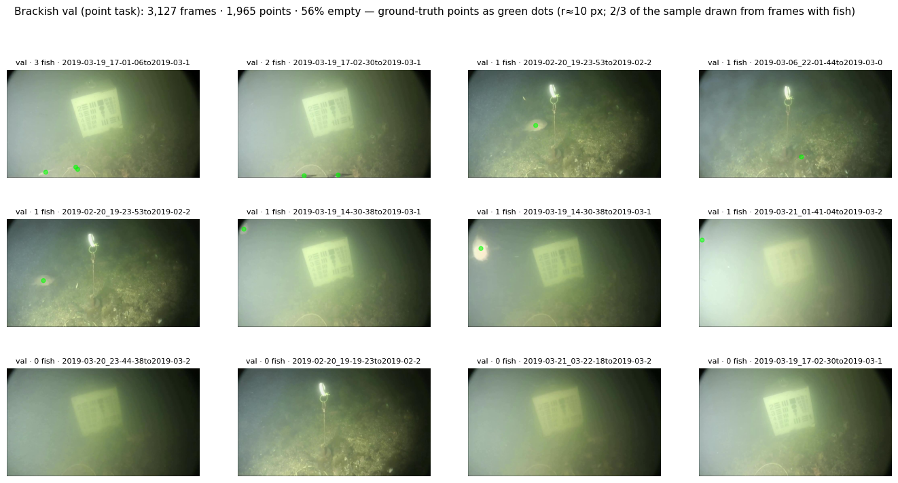

Figure 1. Brackish val frames, GT points green. Turbid fixed-camera footage; most non-empty frames hold one or two fish.

## 2. Dataset Acquisition

CFD's metadata is a 47 MB zip (1.1 GB of JSON inside, *streamed* with `ijson`, never `json.load`-ed); its pixels are on the LILA GCS mirror. Handled by `1_reformat.ipynb`; frames go on the VM's own disk, never on Drive (per-file Drive API latency makes 14.7k JPEG reads crawl).

```bash
# 1. a COCO bbox subset of one source, honouring LILA's own is_train split
python -m cropcounter.cfd subset --metadata data/cfd/community_fish_detection_dataset.json.zip \
    --out data/brackish --sources brackish_dataset --seed 0 \
    --train-cap 100000 --val-cap 100000

# 2. the pixels (resize on write, annotations rescaled to match)
python -m cropcounter.cfd fetch  --subset data/brackish --max-side 1024

# 3. box centres -> COCO keypoints, in a SEPARATE data root
python -m cropcounter.cfd points --subset data/brackish --out data/brackish_points
```

Both caps are inert — Brackish is 14,674 frames, so the subset is the whole source. **The published `is_train` split is used unchanged**: re-splitting would break frame-for-frame comparability with the box run and risk sequence leakage across 89 fixed-camera clips. `--max-side 1024` resizes **nothing** here (960×540 never upscales, every `cfd_scale` returns 1.0); it is kept for parity with the box run and because the other CFD sources need it.

## 3. Dataset Reformatting

CFD ships boxes and this head wants points, so `cfd points` writes `keypoints = [x + w/2, y + h/2, 2]`, one per box, into a **separate data root**. Three things happen there, each a silent failure if skipped:

- **Every box becomes one keypoint.** A bbox-only COCO document has no `keypoints` key, so `parse_coco_keypoints` would attach nothing and train happily on an empty dataset with a finite, falling loss.
- **Ids are renumbered** to consecutive ints (`parse_coco_keypoints` does `int(image["id"])` and CFD ids are *strings*). The original survives as `cfd_image_id`, and `cfd_id_map.json` is the join key back to the box run's string-keyed `predictions.json`.
- **A separate root**, because `resolve_annotations` picks `annotations.json` first — a points file beside the bbox one could never be the file the loader opens. `images/` is a symlink, so no pixel is duplicated.

**Empty frames are retained** — they are the negatives the heatmap head needs.

| Split | Images | Points | Empty images | Empty % |
| ----- | ------ | ------ | ------------ | ------- |
| train | 11,547 | 12,155 | 7,088 | 61.4% |
| val | 3,127 | 1,965 | 1,740 | 55.6% |

Table 1. Images, points and empty frames per split after reformatting. Source: `results/points/table1.md` / `table1.json`, printed from `points_summary.json`, not recomputed. `1_reformat.ipynb` § 6 asserts the conversion through **the loader the trainer uses** (`parse_coco_keypoints(..., labels=["fish"])`): one record per bbox image, as many points as there were boxes, as many empty records as `n_empty` — and it asserts the raw bbox document still raises `ValueError` through the same function.

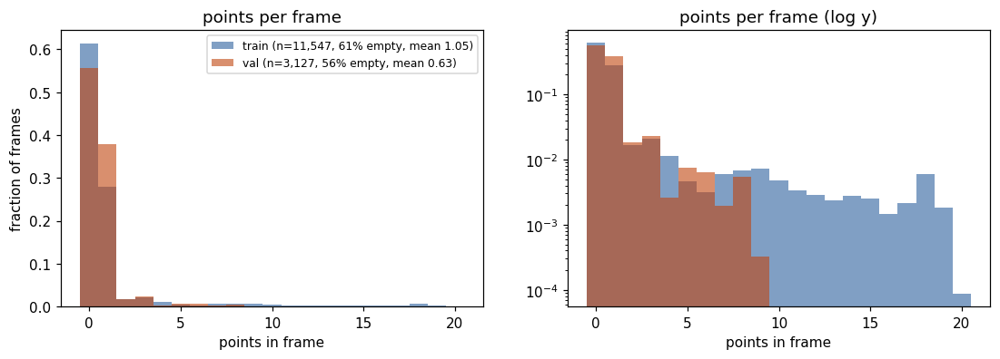

Figure 2. Points per frame — a large zero spike, a long thin tail, mean well under one. This is the shape the counter is scored on, and the reason val loss turns out to be a bad model selector (§ 7.4).

## 4. Training

`config_points_8ep.json` mirrors the box run's recipe minus every box-only field: frozen `base` backbone, `c_dec` 192, output stride 4, `sigma` 2.0, `nms_radius` 1.5, 768-px tiles at **1 tile/frame**, batch 8, **8 epochs**, lr 1e-3 with 2 warm-up epochs, seed 0, `augment_profile "natural"`, `labels ["fish"]`. Handled by `2_training.ipynb`. A100, bf16; **31.9 min** for 8 epochs (≈4 min/epoch including validation on 3,127 frames).

Two defaults are wrong for fish and **both fail silently**, so both are asserted rather than trusted: `labels` defaults to `("Wheat", "Volunteer")` — guarded by requiring the loaded point count to equal the **12,155** boxes in the bbox subset — and `augment_profile` defaults to `"wheat"`, which adds `VerticalFlip` + `RandomRotate90`: label-preserving for nadir crop photos, wrong for underwater footage, which has an up.

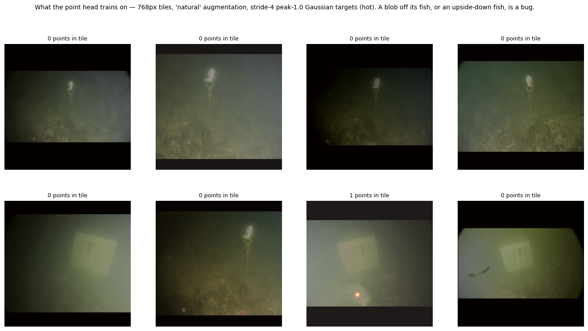

Figure 3. Eight training tiles exactly as the model receives them. No upside-down fish; every hot blob on an animal; black bars where `RandomCrop(pad_if_needed=True)` pads 540 up to 768. **And 7 of the 8 sampled tiles carry zero points.**

**A real difference in the data diet, named before the numbers.** The box run's sampler had `negative_tile_fraction = 0.2` — 80 % of tiles re-cropped until a box survived — so it saw ≈**9.2k positive tiles per epoch**. The point path has no such knob: `CropTileDataset` samples all 11,547 frames uniformly at 1 tile/frame and 61.4 % are empty, so it sees ≈**4.6k positive tiles per epoch**, roughly half. Figure 3 is what that looks like. This is a genuine confound between the two runs and it is stated beside every comparison in § 7, in both directions.

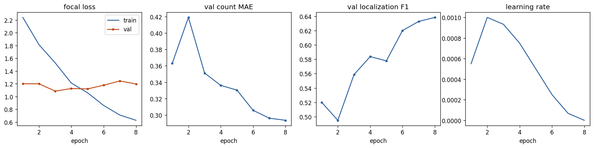

Figure 4. The 8-epoch training history (`runs/brackish_points_s0/curves.png`).

| Epoch | train loss | val loss | count MAE | RMSE | bias | P | R | F1 |
| --- | --- | --- | --- | --- | --- | --- | --- | --- |
| 1 | 2.2414 | 1.2022 | 0.363 | 0.707 | −0.305 | 0.765 | 0.394 | 0.520 |
| 2 | 1.8137 | 1.2001 | 0.419 | 0.780 | −0.308 | 0.733 | 0.374 | 0.495 |
| **3** | 1.5291 | **1.0862** | 0.351 | 0.699 | −0.302 | 0.817 | 0.424 | 0.559 |
| 4 | 1.2119 | 1.1264 | 0.336 | 0.673 | −0.311 | 0.870 | 0.439 | 0.584 |
| 5 | 1.0604 | 1.1205 | 0.330 | 0.647 | −0.309 | 0.858 | 0.436 | 0.578 |
| 6 | 0.8604 | 1.1783 | 0.306 | 0.611 | −0.274 | 0.859 | 0.485 | 0.620 |
| 7 | 0.7103 | 1.2453 | 0.296 | 0.583 | −0.259 | 0.855 | 0.502 | 0.633 |
| **8** | 0.6286 | 1.1979 | **0.294** | **0.585** | **−0.256** | 0.858 | **0.508** | **0.638** |

Table 1b. Per-epoch validation, decoded at the config's **untuned** `tau` 0.3, `nms_radius` 1.5, 24-px match radius. Source: `runs/brackish_points_s0/history.json` (and `train.log`). `best.pt` is written on lowest val loss = **epoch 3**; F1 rose to epoch 8 (0.520 → 0.638) driven entirely by recall (0.394 → 0.508) at a precision that barely moved (0.765 → 0.858). The same val-loss-versus-metric divergence the box run showed, where its bottom was epoch 4.

## 5. Tuning

`tau` is a **decode-time** threshold, so `2_training.ipynb` § 8 sweeps it: `metrics.sweep_tau` computes each val image's probability map once and decodes it at every τ from **0.05 to 0.70 in steps of 0.05**, for four combinations — `best.pt` and `last.pt`, each at `nms_radius` **1.5** (the run's own setting) and **5** (the wheat report's choice). Selection rule fixed before the numbers: **τ = argmin of count MAE**, per the wheat report; the F1 argmax is printed as a sanity check.

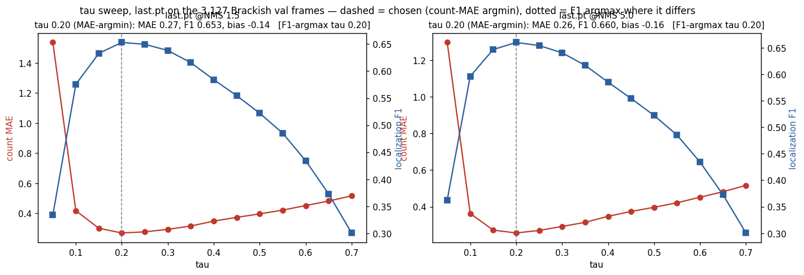

Figure 5. τ sweep for `last.pt` (epoch 8) — count MAE (left axis) against localisation F1 (right axis), NMS 1.5 and NMS 5. `best.pt` is Figure 10.

| Model | Config | MAE | RMSE | Bias | Precision | Recall | F1 |
| ----- | ------ | --- | ---- | ---- | --------- | ------ | --- |
| best epoch 3 | NMS 1.5 | 0.329 | 0.658 | -0.221 | 0.740 | 0.479 | 0.582 |
| best epoch 3 | NMS 5 | 0.306 | 0.635 | **-0.129** | 0.683 | 0.542 | 0.605 |
| last epoch 8 | NMS 5 | **0.256** | **0.547** | -0.156 | **0.769** | 0.578 | **0.660** |
| last epoch 8 | NMS 1.5 | 0.270 | 0.583 | -0.138 | 0.745 | **0.581** | 0.653 |

Table 2. Point-head validation metrics on all 3,127 val frames, each row at **its own calibrated τ**: 0.25 (best/NMS 1.5), 0.20 (best/NMS 5), 0.20 (last/NMS 5), 0.20 (last/NMS 1.5) | `k` 3. Source: `results/points/tuning_table.md`, pasted verbatim from `tau_calibration.json`.
⚠️ **These are radius-matched metrics** — `metrics.sweep_tau`, predicted point to GT *centre* within `match_radius_px` 24 — **not** the point-in-box numbers of § 7. The two tables are not interchangeable.

**The one disagreement, reported not resolved.** For `best.pt` at NMS 1.5 the MAE-argmin (0.25) and F1-argmax (0.20) disagree by one grid step; every other sweep agrees at 0.20. The MAE rule was fixed first, so 0.25 is what `best.pt` carries through § 6–7, and the disagreement is on the record.

**NMS.** The wheat report raised `nms_radius` 1.5 → 5 because smeared wheat heads decoded as duplicates. Fish are not wheat heads: two fish can swim within 5 output cells (20 px) of each other, at which point a wider NMS deletes animals. The six densest val frames are that worst case and are what was looked at (Figure 11). Table 2 puts NMS 5 slightly ahead for both checkpoints (last: F1 0.660 vs 0.653, MAE 0.256 vs 0.270). **The run's own `nms_radius` 1.5 is what § 7 reports**, because it is the setting the checkpoint was configured and trained with; NMS-5 files are written alongside for the record, and on this evidence 5 would probably have helped a little — cheap to settle on a second seed rather than to pick after the fact.

**Best vs last, argued.** `best.pt` is selected by lowest *validation loss*, and val loss here is dominated by the 55.6 % of val frames with no fish: on an empty frame the focal loss rewards a uniformly cold heatmap, and that term keeps falling long after the model stops getting better at finding fish. Table 1b is that pattern — bottom at epoch 3, F1 still climbing at epoch 8 — and it is the box run's pattern at epoch 4. **`last.pt` is the headline, `best.pt` is reported beside it**, both calibrated, with the reason stated rather than a quiet swap to the larger number.

## 6. Test Inference

CFD publishes no test split (`is_train` is a two-way flag), so the scored split is the published **val** split — the same 3,127 frames the box run used. `3_inference.ipynb` writes predictions **once** at a low floor τ = 0.05 and never decodes again: `decode_peaks` applies NMS *before* thresholding and NMS ranks by score, so the set kept at any higher τ is exactly a mask over the 0.05 set. That is what lets § 7 sweep the whole grid without a second forward pass. Inference: **156 s for 3,127 frames × 2 checkpoints** on the A100.

Everything reaches the scorer in **one file shape** — CVAT-for-images 1.1 points — so nothing about a system's original output format can flatter or penalise it. The box head's boxes and RF-DETR-Nano's boxes are reduced to centres, written through the same writer, keyed through `cfd_image_id` / `cfd_id_map.json` to the point root's own file names, and filtered to the same `score >= 0.05` floor.

| File | Images | Points at floor τ 0.05 |
| --- | --- | --- |
| `pred_points_last.xml` (NMS 1.5) | 3,127 | 5,312 |
| `pred_points_last_nms5.xml` | 3,127 | 4,723 |
| `pred_points_best.xml` (NMS 1.5) | 3,127 | 9,793 |
| `pred_points_best_nms5.xml` | 3,127 | 8,778 |
| `pred_boxhead_last_centres.xml` | 3,127 | 28,285 (of 216,851 raw, 13.0 %) |
| `pred_boxhead_best_centres.xml` | 3,127 | 72,789 (of 300,479 raw, 24.2 %) |
| `pred_rfdetr_nano_centres.xml` | 3,127 | 16,395 (of 938,100 raw, 1.7 %) |

Table 3. What `3_inference` wrote. Source: `results/points/run_3_inference.log`. `counts_last.csv` at the calibrated τ 0.20: total 1,532 points, mean 0.490, max 13, 907 non-empty frames (GT total 1,965). `counts_best.csv` at τ 0.25: total 1,273, mean 0.407, max 11, 810 non-empty frames.

**Measured cost, both halves of it** (`flops_params.json`): trainable **3,357,889 (3.358 M)**, frozen backbone **87,566,464 (87.6 M)**, **90.9 M on every forward pass**; **460.7 GFLOPs at 1024×576** — the shape the box memo measured at, so directly comparable — and **407.9 GFLOPs at 960×544**, the shape the model actually sees on a Brackish val frame (960×540 padded to a multiple of 32). The second is the truth about this run's cost; the first is the comparable number.

## 7. Results

### The honesty rules — restated for this experiment, before any number

1. **Never compare against the CFD README's AP.** Different split, different scorer. The only admissible comparator numbers are the ones re-scored here, on these frames, through this scorer.
2. **RF-DETR-Nano trained on all of CFD and very likely saw these val frames.** Its row is biased **in its own favour**, so a loss to Nano is **ambiguous** — possibly memorisation, not capability — and a win over Nano would be **conservative**. Its row carries ⚠️ everywhere.
3. **Trainable parameters AND measured FLOPs, both.** Never "3.4 M vs 30 M": the frozen 87.6 M ConvNeXt-B trunk runs on every forward pass and dominates the arithmetic.
4. **One seed is a read, not a claim.** The box run's epoch-to-epoch AP75 swung ±0.08 on this val split; this run's own epoch-to-epoch F1 at fixed τ 0.3 moved by **−0.025 to +0.064** (`history.json`, Table 1b). That is the noise floor, **"indistinguishable at one seed" is a legitimate outcome**, and every gap below is stated against it.
5. **"Freed capacity" is two mechanisms at once and this design cannot separate them.** Removing the geometry branch removes **0.22 M parameters** *and* **two loss terms that were pulling on the shared fusion trunk** — the decoder is byte-identical between the runs.
6. **The sampler asymmetry (§ 4) is a real data-diet difference** — ≈4.6k vs ≈9.2k positive tiles per epoch — and the leading candidate explanation for anything recall-shaped below.

### The like-for-like table

Five systems, the same 3,127 frames, the same 1,965 GT boxes, one scorer (`point_in_box.match_image`, copied verbatim from Liam's WheatHead `4_evaluate.ipynb`: point-in-box, greedy one-to-one in descending confidence, box edges inclusive, nearest-centre tiebreak), each at **its own** τ.

| System | trainable M | GFLOPs | τ | count MAE | bias | P | R | **point-in-box F1** | mean per-image acc |
| --- | --- | --- | --- | --- | --- | --- | --- | --- | --- |
| **point head last** (epoch 8) | 3.358 | 460.7 @1024×576 | 0.20 | 0.269 | −0.131 | 0.812 | 0.642 | **0.717** | 0.779 |
| point head best (epoch 3) | 3.358 | 460.7 @1024×576 | 0.25 | 0.326 | −0.211 | 0.806 | 0.535 | 0.643 | 0.732 |
| box head last (centres) | 3.58 | 477.0 @1024×576 | 0.35 | 0.256 | −0.059 | 0.782 | 0.708 | 0.743 | 0.791 |
| box head best (centres) | 3.58 | 477.0 @1024×576 | 0.30 | 0.246 | −0.027 | 0.775 | 0.742 | 0.758 | 0.816 |
| RF-DETR-Nano (centres) ⚠️ | ~30 | 97.3 @640² | 0.45 | 0.182 | −0.045 | 0.810 | 0.752 | 0.780 | 0.824 |

Table 4. Point-in-box scoring on CFD Brackish val. Source: `results/points/results.csv` (`row_kind = headline`) and `results_summary.json`. Point-head rows are at the τ **calibrated in `2_training`** (§ 5); the three comparator rows are at their **best-F1 τ from this same sweep**. `mean per-image acc` is `tp/(tp+fp+fn)` averaged over frames, an empty frame with no predictions counting 1.0. Point-head params/GFLOPs measured in `3_inference`; the box-head and Nano cost columns are **from the box memo**, not re-measured.
Reference row (`row_kind = point_head_best_f1_reference`): the point head's *best* checkpoint at its own best-F1 τ 0.20 scores F1 0.666 / P 0.713 / R 0.624 / MAE 0.337 — better than its calibrated 0.643, which is what the § 5 MAE-vs-F1 disagreement costs. `last.pt` needs no such footnote: its calibrated τ and its best-F1 τ are the same 0.20.

**WDA is not quoted.** The wheat report's headline is *weighted* domain accuracy — the mean over domains of mean per-image accuracy. Brackish is **one** domain, one camera in one harbour, so the outer average is over a single value and a "WDA" here would imply a robustness measurement that was not made. The mean per-image accuracy column is that number without the implication; the two breakdowns below are the variance underneath it.

### Where the systems differ

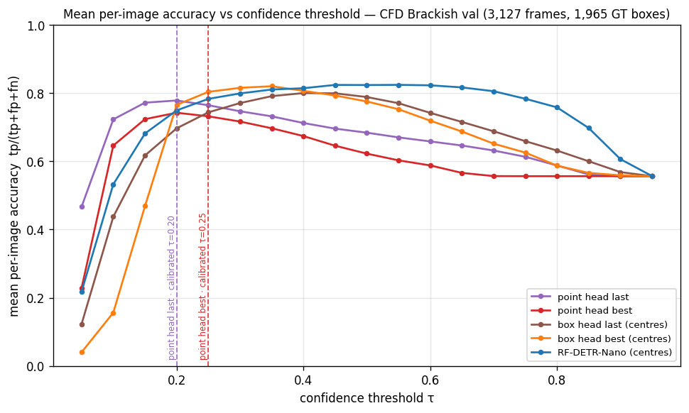

Figure 6 (the Figure-11 analogue). The curves are **separated, not coincident**: the point head's peak early and low, the box-head centres and Nano peak later and higher.

| System | peak mean per-image acc | at τ |
| --- | --- | --- |
| point head last | 0.779 | 0.20 |
| point head best | 0.743 | 0.20 |
| box head last (centres) | 0.800 | 0.40 |
| box head best (centres) | 0.820 | 0.35 |
| RF-DETR-Nano (centres) ⚠️ | 0.824 | 0.55 |

Table 5. Peaks of the Figure-6 curves; spread across the five peaks **0.082**. Source: `results_summary.json` → `peak_mean_accuracy`.

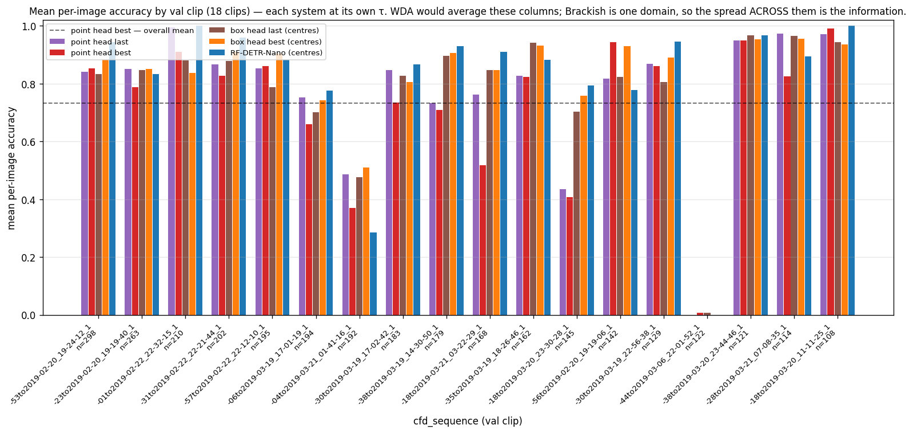

Figure 7 (Figure-12 analogue, first breakdown). 18 val clips, 108–298 frames each.

| System | per-clip mean | sd | worst clip |
| --- | --- | --- | --- |
| point head last | 0.768 | 0.236 | **0.000** |
| point head best | 0.724 | 0.245 | 0.008 |
| box head last (centres) | 0.785 | 0.220 | 0.008 |
| box head best (centres) | 0.809 | 0.222 | 0.000 |
| RF-DETR-Nano (centres) ⚠️ | 0.814 | 0.251 | 0.000 |

Table 6. Per-clip accuracy over 18 val clips. Source: `results_summary.json` → `per_clip_accuracy`. **The worst clip is the same clip for every system**: `2019-03-06_22-01-44to2019-03-06_22-01-52_1`, 122 frames carrying 122 GT boxes — **exactly one fish in every frame and essentially none of them found by anything**, released detector included. Not a point-head failure; one clip's fish that no system here can see. It alone holds 6.2 % of the val boxes and it drags every per-clip mean.

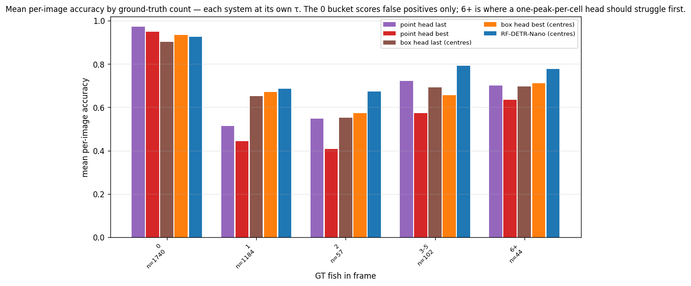

Figure 8 (Figure-12 analogue, second breakdown).

| System | 0 fish | 1 | 2 | 3–5 | 6+ |
| --- | --- | --- | --- | --- | --- |
| **point head last** | **0.972** | 0.513 | 0.548 | 0.721 | 0.700 |
| point head best | 0.950 | 0.445 | 0.408 | 0.573 | 0.634 |
| box head last (centres) | 0.902 | 0.652 | 0.553 | 0.693 | 0.697 |
| box head best (centres) | 0.934 | 0.670 | 0.573 | 0.655 | 0.712 |
| RF-DETR-Nano (centres) ⚠️ | 0.926 | 0.686 | 0.673 | **0.792** | **0.777** |

Table 7. Mean per-image accuracy by GT count, each system at its own τ. Frames per bucket 1,740 / 1,184 / 57 / 102 / 44; GT boxes per bucket 0 / 1,184 / 114 / 360 / 307. Source: `results_summary.json` → `accuracy_by_count_bucket`.

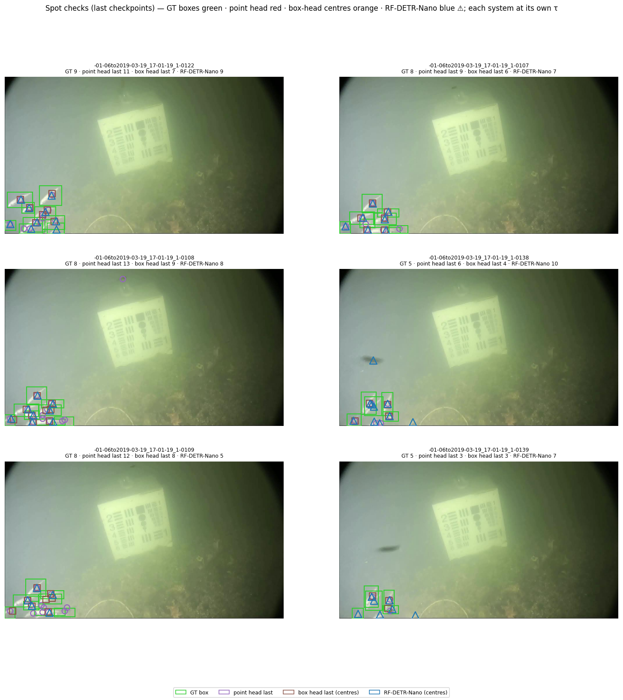

Figure 9. The six spot-check frames for the `last` pair — the three densest, then the three where the systems disagree most at their own τ. Kept counts, point last / point best / box last / box best / Nano against GT (`run_4_evaluate.log`): **GT 9 → 11 / 10 / 7 / 8 / 9**; GT 8 → 9 / 7 / 6 / 6 / 7; **GT 8 → 13 / 5 / 9 / 9 / 8**; GT 5 → 6 / 4 / 4 / 2 / 10; **GT 8 → 12 / 6 / 8 / 9 / 5**; GT 5 → 3 / 1 / 3 / 3 / 7. On the densest frames the point head **over-counts**, and the overlays show why: stacked peaks inside a cluster of overlapping fish at `nms_radius` 1.5 — the same thing Table 2's NMS-5 row shows numerically (count MAE 0.270 → 0.256).

### Interpretation

1. **The point head is the best system here on empty frames and the worst on lone fish, and those two facts are the whole story.** On the 1,740 empty frames it scores **0.972** against 0.902 / 0.934 for the box-head centres and 0.926 for Nano — the fewest false positives of anything in the table, which is also what its precision-heavy operating point (P 0.812 at τ 0.20) says. On the 1,184 single-fish frames it scores **0.513** against 0.652 / 0.670 / 0.686. So the recall gap in Table 4 (0.642 vs 0.708 / 0.742 / 0.752) is **concentrated on lone fish**, not spread evenly: it is level with the box head at 3–5 (0.721 vs 0.693 / 0.655) and at 6+ (0.700 vs 0.697 / 0.712), and behind Nano everywhere above zero.
2. **Did dropping `wh`/`off` cost the heat branch anything? On this one seed: a little, and only on lone fish.** The gap to the box head's *last* checkpoint is **0.717 vs 0.743 = 0.026** point-in-box F1; to its *best* checkpoint, 0.041; to Nano, 0.063. Against rule 4's noise floor — this run's own worst epoch-to-epoch F1 movement of 0.025 — the box-last gap sits **at the floor** and is a null on this evidence, the box-best gap is a little above it, and the Nano gap clears it by ~2.5× (while being ambiguous for rule 2). The honest reading: **the heat branch alone lands in the same neighbourhood as the heat branch with geometry beside it, with no sign of freed capacity**; the direction, such as it is, runs slightly *against* the point head. Rule 5 still binds — had it come out ahead, this design could not have said whether the 0.22 M parameters or the two removed loss terms did it.
3. **The sampler asymmetry is the leading candidate for (1) and (2), and it is not settled here.** The point path saw ≈4.6k positive tiles per epoch to the box run's ≈9.2k, and the deficit lands exactly where halved positive exposure would show first: recall on frames with a single, often small fish. Three cheap tests would settle it, and they are **next steps, not claims** — `tiles_per_image 2` (equalises positive tiles for an epoch's wall-clock), `--drop-empty` on **train only** (val's negatives stay intact so the metric stays comparable), or porting `negative_tile_fraction` from the box path to the point sampler, which is the like-for-like change and the one that isolates the diet from the head shape.
4. **Val loss picked the wrong checkpoint again.** It bottomed at **epoch 3** (1.0862) while F1 rose to epoch 8 (0.520 → 0.638 untuned; 0.643 → 0.717 point-in-box after calibration). The box run showed the identical failure at epoch 4. Two runs, two architectures, one finding: on a 55–61 % empty dataset val loss is dominated by the empty frames and is the wrong model selector for this decoder. Selecting on F1 at the calibrated τ (AP50 for the box path) is a one-line change to `train.py` and should land before any further run on this data.
5. **The calibrated τ is 0.20, not the wheat default 0.3, and at 0.3 this head is precision-heavy to a fault.** Point-in-box at τ 0.30: P **0.902** / R **0.539** / F1 0.675, against P 0.812 / R 0.642 / F1 **0.717** at 0.20 (`results_summary.json` → `sweeps`). The wheat default would have thrown away 0.10 of recall and 0.042 of F1 for precision nobody asked for. The comparators calibrate the other way — box-head centres to 0.35 / 0.30, Nano to 0.45 — which is Figure 6's separation restated: these heads differ in **score calibration as well as ability**, and comparing them at a shared τ would measure the calibration.
6. **One seed, one source, one split, and one clip doing a lot of the damage.** Nothing here establishes anything. It says where to point the next run: the sampler test of (3), a second seed, and F1-based checkpoint selection.

### Verdict

**Dropping the `wh`/`off` geometry branch does not free capacity for the heat branch, and on one seed it costs a little — all of it on lone fish.** The native point head reaches point-in-box F1 **0.717** (P 0.812 / R 0.642, count MAE 0.269) on CFD Brackish val after 8 epochs and 32 minutes of A100 time, against **0.743** for the same decoder's box head reduced to centres on the identical frames through the identical scorer, **0.758** for that box head's other checkpoint, and **0.780** for released RF-DETR-Nano — which trained on all of CFD and very likely saw these frames, so that last gap is ambiguous rather than a clean loss. The 0.026 gap to the box head's headline checkpoint sits at this run's own epoch-to-epoch noise floor and is a null on this evidence; the point head is **the best system here at not hallucinating fish in empty water** (0.972 over 1,740 empty frames) and the worst at finding a single one (0.513 over 1,184), and it saw **half the positive tiles per epoch** that the box run's sampler fed it — so the next spend is the sampler test, not more epochs, and certainly not a second head.

### Verification ledger

| Check | Result |
| --- | --- |
| Test suite green; nothing in `src/` changed for this report | ✅ **148 passed** (`pytest tests/ -q`), **ruff clean** (`ruff check .`) |
| Wheat regression — 122 wheat val images, τ 0.35, `nms_radius` 1.5, MPS | ✅ MAE **8.483607** · RMSE 11.872616 · bias −1.713115 · P 0.741272 · R 0.716832 · **F1 0.728848** · val loss 1.077501 — identical to the box memo's ledger row (8.4836 / 11.8726 / 0.7413 / 0.7168 / 0.7288 / 1.0775) |
| The 12,155-point guard (the `labels` trap) | ✅ `run_2_training.log`: `train: 11,547 images \| 12,155 points (== 12,155 ) \| 7,088 empty (61.4%)` |
| Augment guard (the `augment_profile` trap) | ✅ transform read back — `RandomScale → RandomCrop → HorizontalFlip → RandomBrightnessContrast → HueSaturationValue → Normalize`; **no `VerticalFlip`, no `RandomRotate90`** |
| Round-trip verify of the keypoints conversion, through the trainer's own loader | ✅ Table 1 asserted against `points_summary.json`; val exact at 3,127 images / 1,965 points / 1,740 empty; the raw bbox document still raises `ValueError` through the same function |
| fp32 backbone metric-reproduction gate, TF32 off | ✅ 5 of 6 committed example counts exact (0, 0, 28, 55, 64); the densest gives 90 vs 92 (−2, inside `max(1, 5 %)`); TF32 90 and bf16 90 as well — a threshold-straddling peak, not a wrong tensor set |
| Cross-check against the free first step (no-GPU rescore, `docs/free_first_step.json`) | ✅ worst \|ΔF1\| **0.002634** ≤ 0.02 tolerance (box best +0.000133, box last −0.002634, Nano −0.001420); residual is CVAT storing confidence as a whole percent |
| `counts_last.csv` against the scorer's `n_pred` | ⚠️ accounted for: 1,532 (direct decode at τ 0.20, float scores) vs 1,554 (XML masked at ≥ 0.20, whole-percent scores) = +22, 1.4 % — the same rounding the cross-check above bounds. Both CSVs present and synced. |
| Table 4 equals `results.csv` to 3 dp | ✅ checked programmatically, all five headline rows × six metric columns |
| Every `images/*.png` referenced exists | ✅ 12 figures, each < 1 MB |
| Inference cost measured, not quoted | ✅ 460.7 GFLOPs @1024×576 / 407.9 @960×544 via `torch.utils.flop_counter`; box head 477 and Nano 97.3 cited **from the box memo** |
| CI on the deliverable PR | ✅ PR **#7** (`poc/fish-points`), run 34684324354, `test` pass in 1m55s |
| Everything on Drive | ✅ `frozen-trunk-detection/runs/brackish_points_s0/` (config, history, curves, `best.pt`/`last.pt`, train.log) and `frozen-trunk-detection/results/points/` (7 prediction XMLs, both counts CSVs, table1, tuning_table, tau_calibration, flops_params, results.csv, results_summary.json, 3 run logs, 13 figures, viz/) |

### Open — DiveInsight output decision (Freddie's call, not a default)

This memo measures one thing: whether **finding** fish is helped or hurt by dropping extents. What DiveInsight should *output* is a product decision, and the CFD-contribution requirement in particular is **not** smuggled into the modelling verdict above.

| Option | Serves | Does not serve | Cost |
| --- | --- | --- | --- |
| **Points only** (this experiment) | MaxN, per-frame counts; cheapest head and cheapest labels | length/biomass, species crops, IoU tracking, contributing back to CFD (its spec is COCO boxes) | one head, one model at inference |
| **Points + SAM-class extents** prompted by the points | MaxN, approximate length/biomass, species crops | IoU tracking (mask quality unverified), CFD contribution | a second model at inference |
| **Boxes** (PR #6) | all of the above, including CFD contribution | — | the most expensive head; AP75 was its weak branch |

## 8. References

Varini, F., Morris, J., et al. (2025) *Community Fish Detection Dataset (CFD).* LILA BC. Available at: [https://lila.science/datasets/community-fish-detection-dataset/](https://lila.science/datasets/community-fish-detection-dataset/) (Accessed: 12/09/2026)

Pedersen, M., Bruslund Haurum, J., Gade, R., Moeslund, T.B. and Madsen, N. (2019) *Detection of Marine Animals in a New Underwater Dataset with Varying Visibility* (the Brackish dataset), CVPR Workshops. Available at: [https://www.kaggle.com/datasets/aalborguniversity/brackish-dataset](https://www.kaggle.com/datasets/aalborguniversity/brackish-dataset) (Accessed: 12/09/2026)

Zhou, X., Wang, D. and Krähenbühl, P. (2019) *Objects as Points* (CenterNet) — the head shape, the Gaussian-target radius formula and the penalty-reduced focal loss used here. Available at: [https://arxiv.org/abs/1904.07850](https://arxiv.org/abs/1904.07850) (Accessed: 12/09/2026)

Siméoni, O., et al. (2025) *DINOv3.* Meta AI — the frozen ConvNeXt-B trunk. Available at: [https://arxiv.org/abs/2508.10104](https://arxiv.org/abs/2508.10104) (Accessed: 12/09/2026)

Roboflow (2025) *RF-DETR* — the released `cfd-rf-detr-nano-640` baseline. Available at: [https://github.com/roboflow/rf-detr](https://github.com/roboflow/rf-detr) (Accessed: 12/09/2026)

Cracknell, L. (2026) *Wheat Head Detection — applying crop-counter to GWHD_2021.* `examples/WheatHead/notebooks/docs/report.md` — this report's structure, the τ-calibration convention, the best-vs-last convention, and `match_image`, the point-in-box scorer used verbatim here.

*Frozen-trunk detection head on open marine data — Stage 0 benchmark memo* (2026), branch `poc/detection-head`, PR #6 (parked as draft) — the box run this branch answers, and the source of the box head's AP 0.291 / AP50 0.674 / AP75 0.170 and 3.58 M / 477 GFLOPs, RF-DETR-Nano's AP 0.492 / AP50 0.790 / AP75 0.525 and ~30 M / 97.3 GFLOPs, and the `negative_tile_fraction = 0.2` sampler.

## 9. Appendix

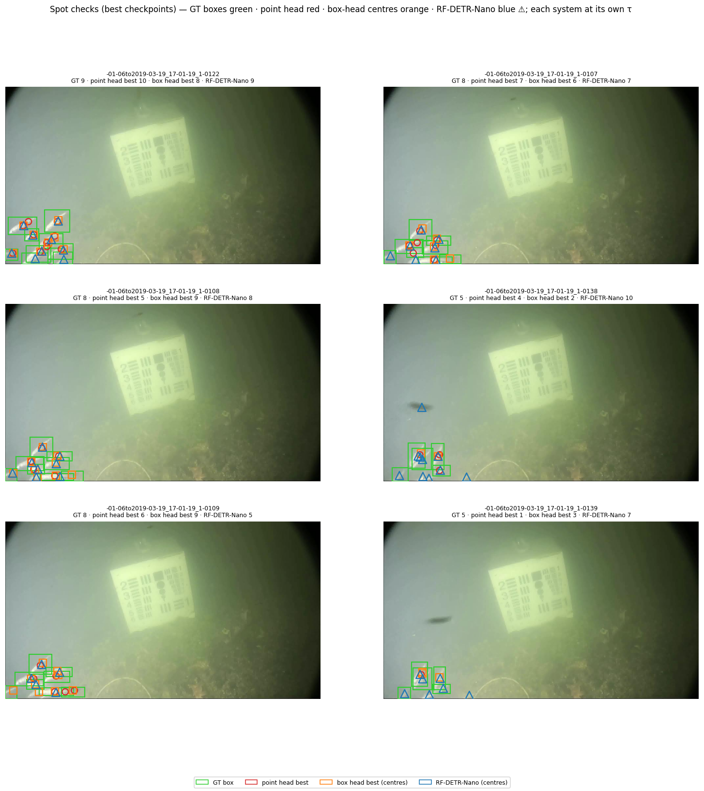

Figure 9b. The same six frames with the `best` pair. On the three densest (GT 9 / 8 / 8) `best.pt` returns **10 / 7 / 5** where `last.pt` returns 11 / 9 / 13 — it **under**-counts two of the three that `last.pt` over-counts, which is the recall half of Table 4's best-vs-last gap (R 0.535 vs 0.642) made visible.

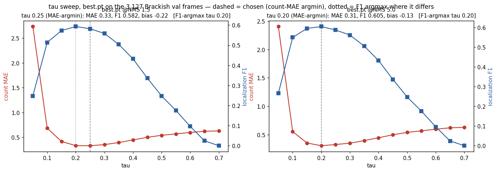

Figure 10. τ sweep for `best.pt` (epoch 3). In the NMS-1.5 panel the MAE argmin (0.25) and the F1 argmax (0.20) disagree — look at how flat the top is: one grid step, not a substantive difference.

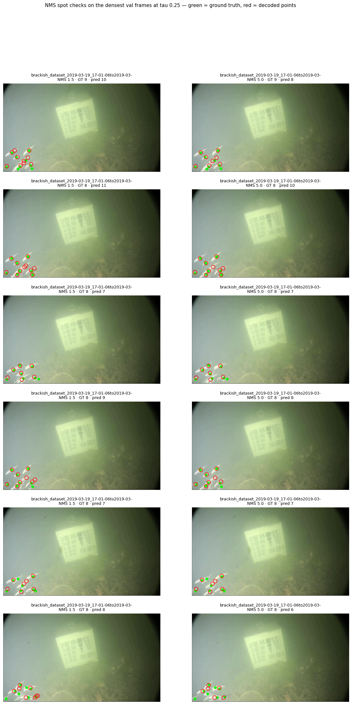

Figure 11. The six **densest** val frames, `best.pt` at its calibrated τ, `nms_radius` 1.5 (left) against 5 (right), GT green and predictions red. Look for a red ring that vanishes on the right **with a green dot still under it** — that would be NMS 5 merging two real fish 20 px apart and would settle the question for 1.5; rings that vanish from a single animal are duplicates and are what NMS is for.

**Also worth re-reading in the appendix, already shown above:** Figure 3, the augmented tile panel — 7 of 8 sampled tiles with no points, which is the sampler asymmetry of § 4 and the confound every § 7 comparison is stated against; and Figure 2, the points-per-frame distribution — the zero spike that makes val loss the wrong model selector (§ 7.4) and makes Table 7's empty-frame column worth having.
