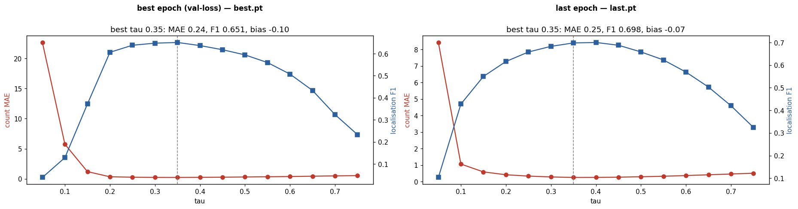
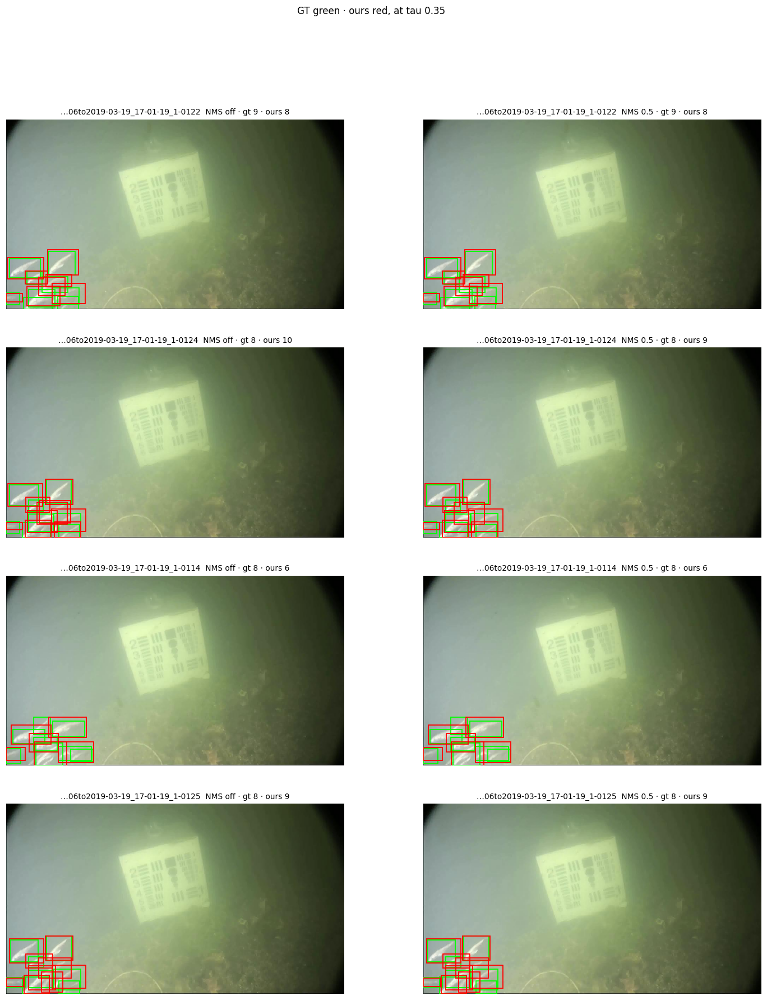

# Frozen-trunk detection head on open marine data — Stage 0 benchmark memo

**Date:** 11 Sep 2026 (skeleton; numbers land as Stage 0c finishes) · **Model:** `crop-counter` `poc/detection-head` — frozen DINOv3 ConvNeXt-B (~89M, `no_grad`) + the existing pyramid decoder (3.36M) + a new 4-channel geometry stem (wh/off, ~0.22M), i.e. CenterNet with its two missing branches added · **Question:** does a small head on *frozen* DINOv3 features detect fish competitively on the Brackish source of the Community Fish Detection Dataset (CFD), scored by the same `pycocotools` harness as the released RF-DETR baselines on the *identical* val images — and is that evidence for or against the frozen-encoder thesis behind wheat V2?

> **Status: SKELETON.** Rules and setup are written *before* any number exists (see § Rules written before the numbers). Results cells are `TBD` until `colab_stage0c_brackish.ipynb` cells 9–14 have run; the numbers come from Drive `frozen-trunk-detection/results/results.csv`, never retyped from memory.

## Prior work — this is not novel, and the memo says so

Frozen-backbone detection heads are well-trodden: ViTDet (frozen/plain ViT backbones), frozen-backbone DETR variants, Detic. The head itself is CenterNet (*Objects as Points*, 2019). The closest prior work is the DINOv2 and DINOv3 papers themselves, which probe frozen dense features for detection. What is defensible here is empirical only: (a) one independent visual domain (turbid underwater video) for a trunk trained on nadir wheat quadrats, (b) a like-for-like comparison against released open baselines on identical images through one scorer, (c) later, leave-one-source-out and label-efficiency curves against the *same architecture unfrozen*.

## Setup

- **Data.** CFD (LILA; Varini, Morris et al. 2025): >1.9M images / >935k boxes, 17 sources, one COCO archive, single class `fish`, per-image `dataset` / `original_data_source` / `is_train`. Stage 0c uses **only the Brackish source** (89 short clips, 14,674 frames in CFD; CC-BY-SA 4.0) — small, turbid, genuinely hard, cleanly licensed. Split = the **published `is_train`** field, never our own. Images fetched per-source from the LILA GCS mirror straight to the Colab VM and **resized to long side 1024 on write** (boxes rescaled in the COCO json); the master JSON is streamed, never `json.load`-ed. Per-source manifest (counts, empty-image fraction, box-size percentiles, stride-4 centre-cell collision rate, licence): `manifest/manifest.md`.
- **Model.** Backbone frozen, eval-mode, `no_grad`; the fusion trunk untouched; `task="box"` adds one `Conv3x3(192→128)-GN-GELU-Conv1x1(128→4)` stem beside the unchanged 1×1 heat head (offset bias initialised 0.5 — the existing decoder's `+0.5` cell-centre prior). Point path has zero new parameters: the shipped wheat `decoder_best.pt` still loads `strict=True` and reproduces MAE 8.59 / F1 0.729 (verification § below).
- **Targets / loss / decode.** CenterNet radius (`min_overlap=0.7`, its formula verbatim), per-object σ, peak exactly 1.0; penalty-reduced focal (bit-identical to the wheat path) + masked L1 on `log(w/4), log(h/4)` and on sub-cell offsets; decode = 3×3 max-pool local max → top-100 → boxes; optional IoU NMS. Empty-image hazard handled in the **sampler** (`negative_tile_fraction=0.2`, positives re-cropped until a box survives), not the loss.
- **Augmentation.** `natural` profile: scale jitter, random crop, horizontal flip, photometric only — **no vertical flip / 90° rotation** (gravity prior underwater; the wheat default would be wrong here).
- **Baseline.** Released `cfd-rf-detr-nano-640` (Apache) run over the same val images at its native 640, threshold 0.001, scored by the same `det_metrics.coco_eval`. RF-DETR-Small-1024 optional.
- **Compute.** Colab **free tier** (T4, session capped at ~5 h) — so the Stage 0c go/no-go run was trimmed at launch from the config's 12 epochs × 2 tiles/frame to **8 epochs × 1 tile/frame** (~11.5k tiles/epoch on 960×540 frames), leaving room for the linear probe and the baseline in one session; T4/L4 for the frozen path (expected CPU-bound on JPEG decode + augmentation — measured in notebook cell 8, `results/throughput_probe.json`). Data on the VM disk; weights, checkpoints, results on Drive.
- **Working dir.** `output/frozen-trunk-detection/` — this memo, `colab_stage0c_brackish.ipynb`, `manifest/`, and (once run) `results.csv`, `predictions.json`, `viz/`. Code: `InsightML/crop-counter` branch `poc/detection-head`.

## Rules written before the numbers

1. **Never cite our AP against the README's `.609 / .596`.** Different, unpublished split. We re-run their weights on our val images instead.
2. **Baseline contamination cuts one way.** Their checkpoints were trained on CFD and very likely *saw* our val images. That biases in *their* favour. So: **a win for the frozen head is conservative; a loss is ambiguous and is reported as ambiguous, not spun.**
3. **Parameter framing.** "3.6M vs 30M" is dishonest — the frozen 89M ConvNeXt-B runs on every forward. Report **trainable params and total inference GFLOPs, both** (notebook cell 13, measured with `torch.utils.flop_counter`).
4. **Licence.** Brackish is CC-BY-SA — fine. Later stages: FathomNet is CC-BY-ND, Marine Detect (GBIF parts) / Salmon CV / TORSI are NC — a research benchmark, not anything InsightML ships; hence the permissive-only variant in Stage 1.
5. **LILA's own `is_train` caveat** (location info not always available; same backgrounds may straddle splits) inflates every in-domain number, ours and theirs. Protocol B (leave-one-source-out) is the trustworthy headline, not this.
6. **Seeds.** ≥2 seeds on the headline config before any claim; Stage 0c is one seed and is treated as a go/no-go, not a result.
7. **Kill criterion (fixed now):** frozen head **AP50 < ~0.5 while RF-DETR-Nano > ~0.8** on Brackish val ⇒ the frozen-trunk premise fails for underwater imagery → rescope to partial unfreeze (last ConvNeXt stage) or to the label-efficiency claim alone.
8. **Linear-probe reading (fixed now):** non-trivial AP with the fuse trunk frozen too ⇒ DINOv3 features are near-linearly box-decodable (thesis strong). Near-zero while the full decoder works ⇒ the story is the *decoder*, not the *features*. That reading only holds when the frozen trunk is a *trained* one: the first probe run froze a **randomly initialised** fuse trunk — `build_model` constructed a fresh decoder and nothing loaded the wheat weights into it — so its numbers describe a random trunk rather than the features and are reported as **uninformative**, while the informative variant seeds the trunk from the wheat decoder before freezing (`config_linearprobe_wheatinit.json`, `init_decoder_from: weights/decoder_best.pt`).
9. Any throughput/speed claim is **measured** in the notebook or not made.

## Results

| Model | Input | Trainable M | Total M | GFLOPs | AP | AP50 | AP75 | AR100 | F1 @IoU.5 (τ per row = calibrated, see Tuning) |
|---|---|---|---|---|---|---|---|---|---|
| Frozen DINOv3-B + decoder + box head (`brackish_frozen_s0`) | 1024 long side | TBD | TBD | TBD | TBD | TBD | TBD | TBD | TBD |
| Linear probe: fuse trunk frozen too, 2 ep (`brackish_linearprobe_s0`) | 1024 long side | TBD | TBD | TBD | TBD | TBD | TBD | TBD | TBD |
| RF-DETR-Nano, released (⚠️ likely saw these images) | 640 | — | ~30 | TBD | TBD | TBD | TBD | TBD | — |

**Stage 0a — green (2026-09-11).** `tests/test_boxmap.py`: 57 tests; GT `(hm, wh, off)` → `decode_boxes` recovers all boxes to < 1e-3 px in both `log` and `linear` parameterisations and `coco_eval` scores AP = AP50 = 1.0; peak exactly 1.0; radius monotonic and equal to CenterNet's formula; `top_k` truncation and IoU-NMS verified; `parse_coco_detection` round-trips string ids and skips `empty` markers. Whole suite **169 passed**, ruff clean. Simulated CFD-like frames (960×540, median 46 px boxes): stride-4 centre-cell collisions 0.01 % at 10 fish/frame, 0.08 % at 50 — the empirical case against a stride-2 decoder.
**Stage 0c manifest facts (real metadata, `manifest/manifest.md`, streamed in 22 s):** Brackish in CFD = **14,674 frames / 14,120 boxes / 89 clips**, native **960×540** (so the 1024 long-side cap does not resize it), median box **45.7 px** (0.048 of the long side), **60.2 % of frames empty**, stride-4 centre-cell collision rate **0.0 %**. Published split: train 11,547 frames (71 clips, 12,155 boxes) / val 3,127 frames (18 clips, 1,965 boxes, 1,740 empty) — **clip-clean, 0 sequence overlap**, which independently validates both LILA's split and our sequence key. Whole-CFD context: 1,903,035 images / 935,049 boxes (matches LILA exactly), **64.8 % empty overall**, `is_train` never missing; TORSI collides at 15.6 % at stride 4 (every other source ≤ 0.8 %) — it needs a finer head or dropping in Stage 2.
Throughput probe (img/s, GPU util by `num_workers`): TBD.

## Tuning

`tau` is the decode confidence threshold: heatmap peaks scoring below it never become predictions. Every P/R/F1 the go/no-go run printed used the config's reference `tau` 0.3 — a number fixed before the run and never tuned — so § 4 of [`4_evaluate.ipynb`](../4_evaluate.ipynb) calibrates it as the wheat example does (`WheatHead` report § 5): one forward pass over Brackish val, decoded **once** at `ap_tau` 0.01, then every `tau` from 0.05 to 0.75 in steps of 0.05 applied as a mask over that one decoded set (`det_metrics.sweep_tau_boxes`). The whole sweep costs one epoch of inference, not fifteen.

**Both checkpoints are calibrated, and the last epoch is the headline.** `train.py` writes `best.pt` on lowest *validation loss*. On this run that selector disagreed with every detection metric: it stopped at an earlier epoch while AP, AP50, AP75 and F1 all kept improving through to the last one (see the Results table's paired rows). The head anyone would actually ship is therefore `last.pt`, and it — not `best.pt` — is the headline number in this memo. Its optimal `tau` need not equal `best.pt`'s either: the score distribution keeps moving as the cosine anneals and the geometry branch converges, so each checkpoint is swept on the same grid and **reported at its own `tau`**, never at one borrowed threshold. Whether the two agree is a finding in itself and the notebook prints it as a one-line verdict.

Selecting on val loss and then reporting the epoch it did not pick needs saying out loud rather than quietly swapping: the val-loss rule is the house convention (it is what the wheat example uses, and it is checkpoint selection that never touches the test set), it simply turns out to be the wrong proxy here. The honest reading is that **on Brackish the box head's val loss is a poor model-selection signal**, which is itself reportable and which Stage 1 should fix by selecting on val AP50 instead — not something to paper over by quoting `last.pt` as if it had been chosen all along.

Figure T1. TBD — the `tau` sweep on the val set, **left: `best.pt` (best epoch by val loss), right: `last.pt` (last epoch, the headline)**, both at the run's own NMS setting. Written by the notebook to `docs/images/tau_sweep.png` and to Drive `results/viz/tau_sweep.png`.

**Choice of `tau` — TBD.** Each checkpoint's `tau` is the **argmin of its own count MAE**: `best.pt` → **TBD**, `last.pt` (headline) → **TBD**. The F1-argmax `tau` for each is **TBD** / **TBD**. All of it is persisted in `results/tau_calibration.json` — top-level `best_tau` is the **headline (`last.pt`) `tau`** so the results-table cell and any older reader keep working unchanged, `best_tau_bestckpt` carries `best.pt`'s own, `headline_checkpoint` names which is which, and the full per-`tau` rows sit under `best.sweep` / `last.sweep`. Nothing here is retyped from memory into this memo.

Within a checkpoint, the MAE-argmin and the F1-argmax `tau` ought to agree — the best localisation should also be the lowest count error, and the wheat run had both at 0.2. Where they disagree the gap *is* the finding: a threshold whose over- and under-counts cancel to a flattering mean while localisation is worse. Per rule 2, that is written up as ambiguous, with both numbers quoted, rather than resolved in whichever direction reads better. The same applies across checkpoints: if `best.pt` and `last.pt` calibrate to different `tau`, the memo says so and reports each at its own, because a single shared threshold would silently hand one checkpoint an operating point it was never tuned for.

**AP / AP50 / AP75 / AR100 did not move, and could not have.** They integrate over the score axis, so they are threshold-independent by construction: no choice of `tau` can change them, for either checkpoint. The sweep therefore does not report them, and the AP columns of the Results table above are untouched by calibration — only the operating-point columns (P/R/F1 and the counts) are recomputed at the calibrated `tau`, from the same detection files the AP is scored on. `train.py` only saves `predictions.json` for the best-val-loss epoch, so § 4 additionally decodes `predictions_last.json` for the last epoch at the identical `ap_tau`, top-k, NMS setting and frame clipping; that is what lets the last-epoch row carry a rescored AP and an operating point instead of history-only numbers.

**NMS — TBD.** `box_nms_iou` was `null` for the go/no-go run: the 3×3 local-max peak test alone deduplicates cleanly when boxes do not overlap much, which Brackish's 0.0 % stride-4 centre-cell collision rate suggested would hold. The comparison below runs each checkpoint at its own calibrated `tau`, with suppression **inside** the decode and before any thresholding — NMS ranks by score and has to see the whole candidate set, so each setting costs its own pass. The headline `last.pt` gets the full grid; `best.pt` gets off vs 0.5, enough to show the decision does not flip between the two checkpoints.

| Checkpoint | τ | NMS IoU | Precision | Recall | F1 | count MAE | n_pred |
|---|---|---|---|---|---|---|---|
| last epoch (headline) | TBD | none | TBD | TBD | TBD | TBD | TBD |
| last epoch (headline) | TBD | 0.5 | TBD | TBD | TBD | TBD | TBD |
| last epoch (headline) | TBD | 0.6 | TBD | TBD | TBD | TBD | TBD |
| best epoch (val-loss) | TBD | none | TBD | TBD | TBD | TBD | TBD |
| best epoch (val-loss) | TBD | 0.5 | TBD | TBD | TBD | TBD | TBD |

Table T1. NMS comparison, each checkpoint at its own calibrated `tau` — source: `results/tau_calibration.json`, key `nms` (`nms.last`, `nms.best`). **Decision: TBD.** The wheat run raised its point-NMS radius from 1.5 to 5 after spot checks showed duplicate points on smeared heatmap regions; whether the box head needs the IoU analogue underwater is an open question here, and Figure T2 is the evidence it is answered on, not the aggregate alone.

Figure T2. TBD — four val frames carrying ≥ 3 GT fish, NMS off (left) vs NMS 0.5 (right) on the **headline `last.pt`** at its calibrated `tau`, GT green · ours red. `docs/images/nms_compare.png` and Drive `results/viz/nms_compare.png`. Look for: one fish wearing two boxes (the case NMS exists for) against a real fish lost to suppression (the case it costs).

| Model | Config | MAE | RMSE | Bias | Precision | Recall | F1 |
|---|---|---|---|---|---|---|---|
| best epoch (val-loss) | NMS off @τ=TBD | TBD | TBD | TBD | TBD | TBD | TBD |
| best epoch (val-loss) | NMS 0.5 @τ=TBD | TBD | TBD | TBD | TBD | TBD | TBD |
| last epoch | NMS off @τ=TBD | TBD | TBD | TBD | TBD | TBD | TBD |
| last epoch | NMS 0.5 @τ=TBD | TBD | TBD | TBD | TBD | TBD | TBD |

Table T2. Validation metrics **at per-row `tau`, not one global `tau`** — each row carries the threshold its own checkpoint calibrated to, in the Config column | IoU 0.5 | top-k 100. Generated by the notebook as `results/tuning_table.md` and pasted here verbatim. **Best epoch means lowest validation loss** — the rule `train.py` writes `best.pt` on — not best AP. **Headline checkpoint = the last epoch**, because that selector stopped early while every detection metric kept improving; both are tabulated so the trade is shown, not chosen silently.

## Visual spot checks

TBD — `results/viz/spot_checks.png`: six val images spanning the GT-count range, GT green · ours red · RF-DETR blue. Look for: missed small fish (stride-4 floor), duplicate boxes on one fish (NMS off), box-size bias (log-space L1), turbid-background false positives.

## Interpretation

TBD. Apply rules 2, 7 and 8 mechanically before writing a sentence of narrative.

## Implications

- **For the [[foundation-model-transfer-learning]] thesis / wheat V2:** TBD — this is the thesis's first data point outside wheat; write what it supports and what it does not.
- **For Stage 1+:** go / rescope per rule 7. If go: Protocol A on the published split with baselines re-scored + permissive-only variant; Protocol B LOSO with the *unfrozen* twin as comparator (GPU spend goes here); Protocol C label efficiency.
- **Licence:** ⚠️ the DINOv3 commercial-licence question on the framework page is still open — settle it before wheat V2 depends on the answer.
- **Not building:** backbone feature caching (16.9 MiB fp16 per 768² tile → ~177 GB for 10k tiles, and augmentation invalidates it).

## Verdict

TBD — one honest paragraph, including "this doesn't work" if that is the answer.

## Verification ledger

| Check | Result |
|---|---|
| Existing test suite green after the change | ✅ 169 passed (66 pre-existing unchanged + 57 boxmap + 46 cfd), ruff clean |
| `decoder_best.pt` loads `strict=True` into the point model | ✅ point path has zero new parameters; state-dict key set asserted equal in a test |
| Wheat val (122 imgs, τ=0.35, MPS) reproduced before AND after | ✅ identical to every printed digit: MAE 8.4836 · RMSE 11.8726 · P 0.7413 · R 0.7168 · **F1 0.7288** · val loss 1.0775. (The 8.59 MAE quoted in the scale-test memo came from a different eval setting; the check here is the before/after identity.) |
| Stage 0a round-trip tests green | ✅ see § Results |
| End-to-end on REAL Brackish frames (local, MPS): `cfd subset` 24+12 frames → `fetch` → 1-epoch `train --task box` → `predictions.json` + COCO eval | ✅ ran clean after one fix it caught (fetch left `JPEGImages/` in `file_name`; now basename + `cfd_file_name`). 14/24 train frames empty → sampler active, `n_pos` 6–16 per batch, loss finite, val eval + artefacts written. AP after 1 epoch on 24 images is 0 by construction, not a result. |
| Converted backbone reproduces committed example counts in the cloud (notebook cell 4, Colab T4) | ✅ strict load OK; under the T4's **fp16** autocast 5 of 6 images reproduce the fp32/MPS reference counts exactly (0, 0, 28, 55, 64) and the densest (92 plants) gives 89 — τ=0.35 threshold noise on a dense image, not a backbone mismatch. Gate relaxed from ±1 to 5 % relative for fp16; the split example notebook will run the check in fp32 for a like-for-like ±1. |
| Baseline re-scored through our `coco_eval` (metric parity) | TBD |
| Branch is `poc/detection-head`, never `main` | ✅ |
