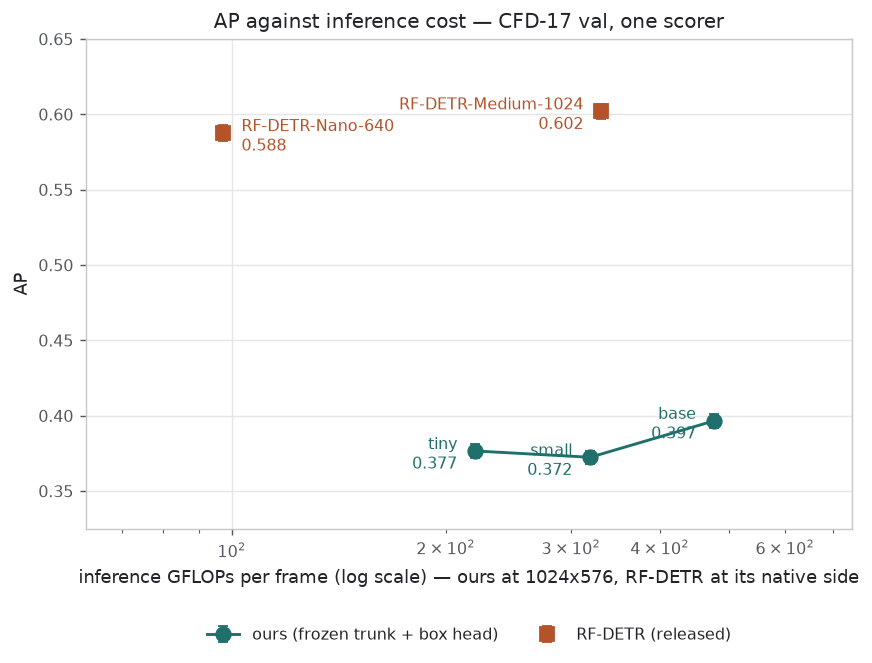
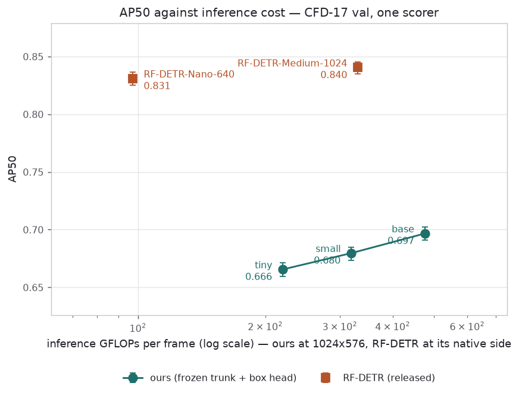
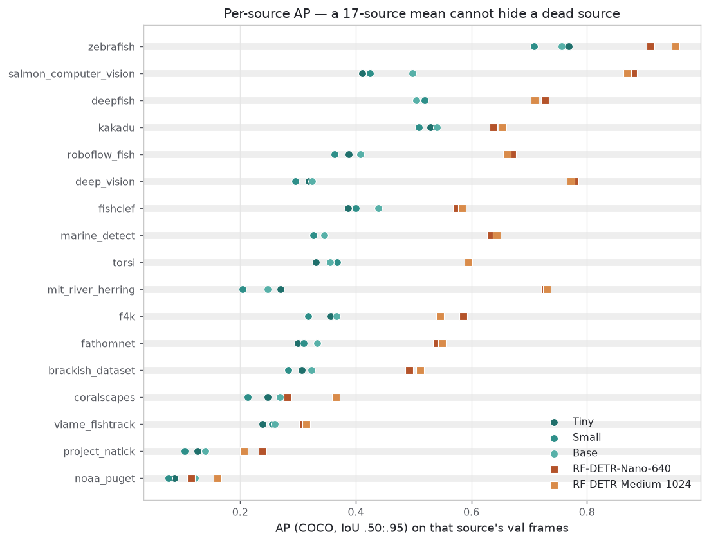
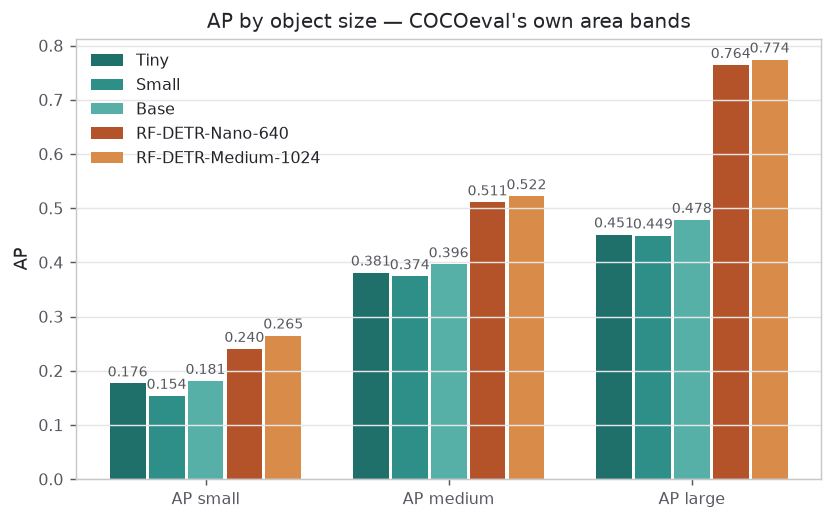
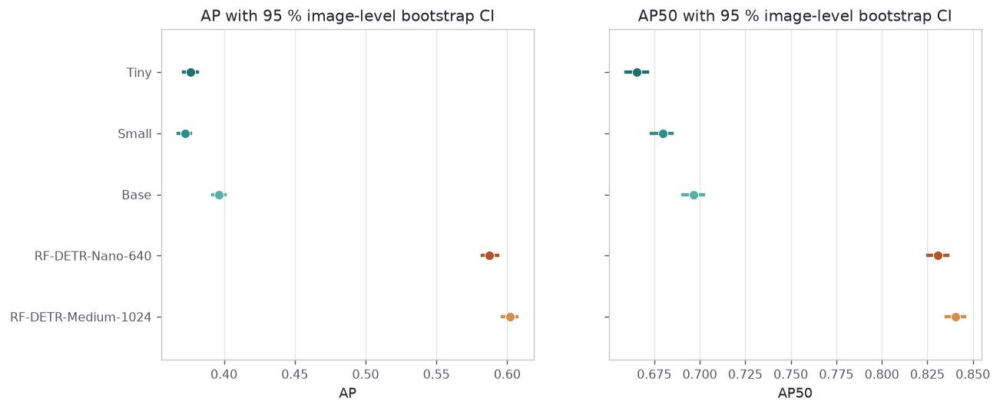
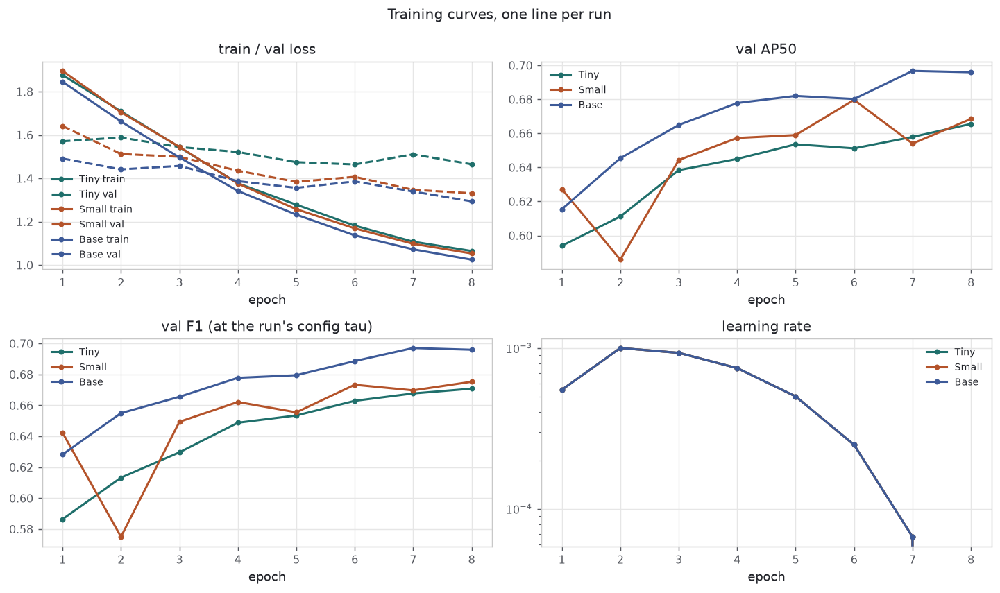
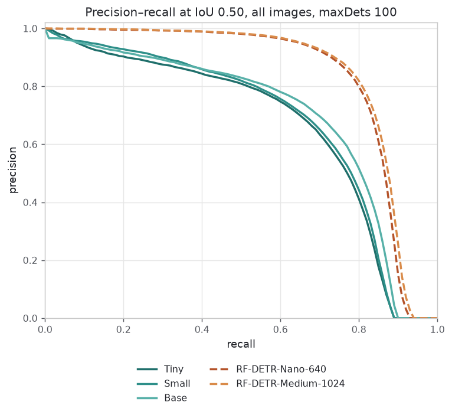
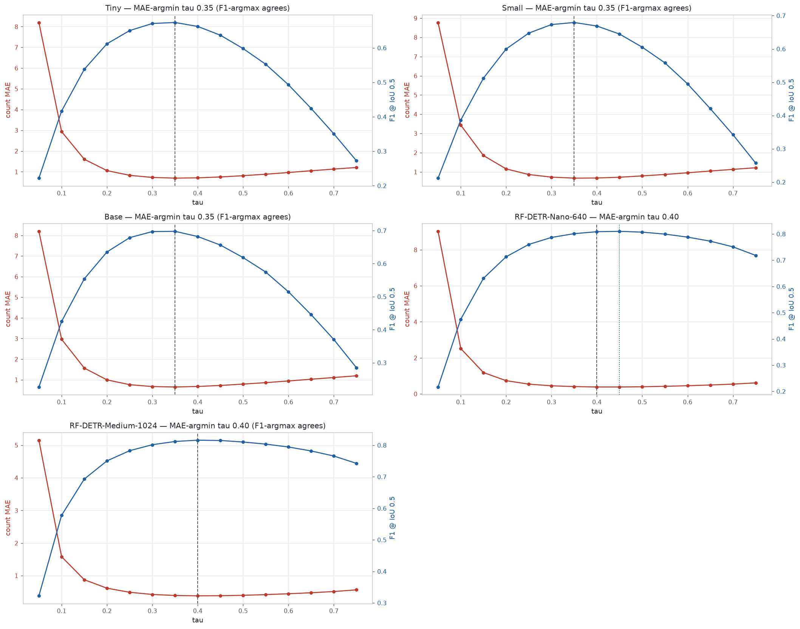

# Trunk size vs cost vs accuracy — CFD-17 val

CFD-17 val, 36632 images over 17 sources · 5 system(s) · 1000 bootstrap resamples, seed 0, 3 worker(s) · generated in 5893.4s by size_report.py

> Baseline contamination favours RF-DETR: it was trained on the full CFD train split; our val frames are CFD's published is_train=false frames, but the clip-level split is unpublished.

> One seed per size: differences inside the bootstrap CI are evaluation noise; differences outside it are still single-seed reads.

> Trainable parameters and total FLOPs are both reported; a frozen trunk saves training compute, never inference compute.

## 1 · Headline — cost and accuracy per system

| System | Trunk | Trainable M | Total M | GFLOPs | FLOPs input | img/s | ms/img | Peak GPU MB | AP | AP50 | AP75 | AR100 | tau | F1 @tau | count MAE @tau |
|---|---|---|---|---|---|---|---|---|---|---|---|---|---|---|---|
| Tiny | tiny | 3.49 | 31.31 | 220.0 | 1024x576 | 123.36 | 8.1 | 394 | 0.3766 | 0.6656 | 0.3843 | 0.5299 | 0.35 | 0.6736 | 0.694 |
| Small | small | 3.49 | 52.94 | 319.4 | 1024x576 | 78.93 | 12.7 | 483 | 0.3724 | 0.6797 | 0.3650 | 0.5204 | 0.35 | 0.6795 | 0.674 |
| Base | base | 3.58 | 91.15 | 477.0 | 1024x576 | 75.68 | 13.2 | 640 | 0.3966 | 0.6967 | 0.4083 | 0.5433 | 0.35 | 0.6978 | 0.648 |
| RF-DETR-Nano-640 | — | — | — | 97.3 | 640x640 | 58.34 | 17.1 | — | 0.5876 | 0.8309 | 0.6479 | 0.6916 | 0.40 | 0.8087 | 0.386 |
| RF-DETR-Medium-1024 | — | — | — | 331.1 | 1024x1024 | 50.64 | 19.7 | — | 0.6020 | 0.8404 | 0.6613 | 0.7011 | 0.40 | 0.8161 | 0.381 |

*Trainable/total parameters, GFLOPs and throughput come from trunk_<size>.json (measure_trunk.py) for ours and from baseline_metrics.json for RF-DETR; AP/AP50/AP75/AR100 and the calibrated tau come from results_summary.json (evaluate_cfd17.py) and are re-derived here through pycocotools as a parity check. — means the number is not on disk — it has not been substituted.*

## 2 · The decision plot — accuracy against inference cost

Log x, because the trunk sizes are separated by multiples, not by increments. Error bars are the 95 % image-level bootstrap CI from section 4a: a gap inside two overlapping bars is not a gap this evaluation can see.

*AP against measured inference GFLOPs. Ours joined by trunk size; RF-DETR a separate series at its own native input.*

*The same plot on AP50 — the detection axis, with localisation tightness taken out.*

## 3 · Where the AP comes from

### Per source

| Source | val images | Tiny | Small | Base | RF-DETR-Nano-640 | RF-DETR-Medium-1024 |
|---|---|---|---|---|---|---|
| brackish_dataset | 3127 | 0.3070 | 0.2827 | 0.3234 | 0.4923 | 0.5113 |
| coralscapes | 392 | 0.2470 | 0.2133 | 0.2692 | 0.2816 | 0.3659 |
| deep_vision | 305 | 0.3187 | 0.2954 | 0.3243 | 0.7789 | 0.7715 |
| deepfish | 53 | 0.5051 | 0.5188 | 0.5042 | 0.7270 | 0.7099 |
| f4k | 191 | 0.3562 | 0.3178 | 0.3669 | 0.5861 | 0.5460 |
| fathomnet | 3999 | 0.3004 | 0.3097 | 0.3336 | 0.5404 | 0.5491 |
| fishclef | 2604 | 0.3863 | 0.4001 | 0.4395 | 0.5747 | 0.5836 |
| kakadu | 4000 | 0.5288 | 0.5094 | 0.5407 | 0.6383 | 0.6543 |
| marine_detect | 4000 | 0.3263 | 0.3267 | 0.3452 | 0.6341 | 0.6444 |
| mit_river_herring | 4000 | 0.2703 | 0.2038 | 0.2472 | 0.7273 | 0.7306 |
| noaa_puget | 4000 | 0.0865 | 0.0762 | 0.1223 | 0.1156 | 0.1603 |
| project_natick | 215 | 0.1259 | 0.1035 | 0.1392 | 0.2387 | 0.2063 |
| roboflow_fish | 406 | 0.3880 | 0.3633 | 0.4073 | 0.6705 | 0.6621 |
| salmon_computer_vision | 4000 | 0.4116 | 0.4246 | 0.4982 | 0.8796 | 0.8696 |
| torsi | 202 | 0.3306 | 0.3683 | 0.3554 | 0.5951 | 0.5945 |
| viame_fishtrack | 4000 | 0.2385 | 0.2554 | 0.2602 | 0.3086 | 0.3139 |
| zebrafish | 1138 | 0.7688 | 0.7082 | 0.7561 | 0.9095 | 0.9531 |

*AP per CFD source, computed from the same single COCOeval pass by restricting the accumulation to that source's images.*

*One row per source, one marker per system.*

### Per object size

| System | AP small | AP medium | AP large |
|---|---|---|---|
| Tiny | 0.1765 | 0.3809 | 0.4513 |
| Small | 0.1536 | 0.3742 | 0.4492 |
| Base | 0.1811 | 0.3962 | 0.4782 |
| RF-DETR-Nano-640 | 0.2402 | 0.5105 | 0.7639 |
| RF-DETR-Medium-1024 | 0.2648 | 0.5218 | 0.7739 |

*COCOeval stats[3..5] — AP on objects under 32x32 px, 32-96 px and above 96 px, from a COCOeval run here over the full val split.*

*AP small / medium / large per system.*

## 4 · Statistics, and what they are not

### 4a · Image-level bootstrap CIs

Each system's detections were scored by one COCOeval pass over all 36632 val images; that pass's per-image evaluation entries were then resampled with replacement 1000 times and re-accumulated. COCOeval.evaluate() is never re-run, so a resample costs an accumulate rather than a full evaluation, and every system is scored on the same resampled image sets (common random numbers, derived from --seed alone).

| System | AP | AP 2.5 % | AP 97.5 % | AP50 | AP50 2.5 % | AP50 97.5 % | resamples | seconds |
|---|---|---|---|---|---|---|---|---|
| Tiny | 0.3766 | 0.3718 | 0.3815 | 0.6656 | 0.6593 | 0.6712 | 1000 | 580.5 |
| Small | 0.3724 | 0.3677 | 0.3765 | 0.6797 | 0.6732 | 0.6850 | 1000 | 537.7 |
| Base | 0.3966 | 0.3919 | 0.4009 | 0.6967 | 0.6908 | 0.7023 | 1000 | 551.7 |
| RF-DETR-Nano-640 | 0.5876 | 0.5823 | 0.5931 | 0.8309 | 0.8253 | 0.8363 | 1000 | 899.8 |
| RF-DETR-Medium-1024 | 0.6020 | 0.5968 | 0.6071 | 0.8404 | 0.8352 | 0.8455 | 1000 | 3020.1 |

*2.5th and 97.5th percentiles over the resamples.*

*Point estimate and 95 % CI per system.*

### 4b · Paired comparisons across trunk sizes

Paired over CFD sources: each source is one matched observation, so a trunk that wins by dominating a single large source does not look like a trunk that wins everywhere. Median paired difference and sources-won are the reading; the p-value is the third number, not the first.

| A vs B | median dAP | sources A wins | sources B wins | ties | test | statistic | p |
|---|---|---|---|---|---|---|---|
| Tiny vs Small | +0.0195 | 10 | 7 | 0 | wilcoxon-signed-rank | 39.0 | 0.0797 |
| Tiny vs Base | -0.0189 | 3 | 14 | 0 | wilcoxon-signed-rank | 18.0 | 0.0038 |
| Small vs Base | -0.0394 | 2 | 15 | 0 | wilcoxon-signed-rank | 5.0 | 0.0002 |

*Per-source AP, paired. A > B means the left system is ahead.*

Paired over val images on matched F1 at each system's own calibrated tau. An image with no ground truth and no surviving detection scores F1 = 1.0 for both systems, so it contributes an exact zero to the difference and is discarded by the signed-rank test; the count of non-zero pairs is reported beside it.

| A vs B | tau A | tau B | mean dF1 | dF1 2.5 % | dF1 97.5 % | images | non-zero pairs | test | p |
|---|---|---|---|---|---|---|---|---|---|
| Tiny vs Small | 0.35 | 0.35 | +0.0081 | +0.0049 | +0.0113 | 36632 | 11495 | wilcoxon-signed-rank | 2.992e-05 |
| Tiny vs Base | 0.35 | 0.35 | -0.0272 | -0.0303 | -0.0240 | 36632 | 11559 | wilcoxon-signed-rank | 9.068e-67 |
| Small vs Base | 0.35 | 0.35 | -0.0353 | -0.0383 | -0.0323 | 36632 | 11319 | wilcoxon-signed-rank | 2.976e-103 |

*Per-image matched F1, paired, with a bootstrap CI on the mean difference.*

### 4c · Scope

> One seed per size: differences inside the bootstrap CI are evaluation noise; differences outside it are still single-seed reads.

These intervals resample IMAGES. They measure how much of each number is an accident of which frames landed in the val split — nothing else. They do not contain initialisation, data-order or augmentation variance, because there is one training seed per trunk size. Before any size is chosen on the strength of a gap this report shows, run a second seed of the chosen size and re-read the gap against the seed-to-seed spread.

## 5 · Training, PR and calibration

*Train/val loss, val AP50, val F1 and the LR schedule, one line per run dir.*

*From COCOeval's precision array at IoU 0.50, area 'all', maxDets 100.*

*The 4_evaluate.ipynb twin-axis panel: count MAE (red, left) against matched F1 (blue, right); dashed line at the MAE-argmin tau the headline quotes, dotted at the F1-argmax tau where the two disagree.*

### Best epoch against last epoch

| Run | Checkpoint | AP | AP50 | AP75 | F1 @tau | tau |
|---|---|---|---|---|---|---|
| Tiny | best (selected) | 0.3766 | 0.6656 | 0.3843 | 0.6736 | 0.35 |
| Tiny | last (final epoch) | 0.3766 | 0.6656 | 0.3843 | 0.6736 | 0.35 |
| Small | best (selected) | 0.3724 | 0.6797 | 0.3650 | 0.6795 | 0.35 |
| Small | last (final epoch) | 0.3829 | 0.6685 | 0.3928 | 0.6723 | 0.35 |
| Base | best (selected) | 0.3966 | 0.6967 | 0.4083 | 0.6978 | 0.35 |
| Base | last (final epoch) | 0.3967 | 0.6959 | 0.4036 | 0.6968 | 0.35 |

*predictions.json (the selected epoch) against predictions_last.json (the final epoch), both rescored by the same function. Liam's convention: report both, argue the pick, never quote the flattering one silently.*

## Recommendation — TEMPLATE, numbers filled in, wording not

| System | Trunk | GFLOPs | AP | AP50 | AP vs Base | GFLOPs x vs Base | GFLOPs x vs RF-DETR-Nano-640 | AP vs RF-DETR-Nano-640 |
|---|---|---|---|---|---|---|---|---|
| Tiny | tiny | 220.0 | 0.3766 | 0.6656 | -0.0200 | 0.46x | 2.26x | -0.2110 |
| Small | small | 319.4 | 0.3724 | 0.6797 | -0.0242 | 0.67x | 3.28x | -0.2152 |
| Base | base | 477.0 | 0.3966 | 0.6967 | +0.0000 | 1.00x | 4.90x | -0.1910 |

*Accuracy lost against FLOPs saved. Positive AP deltas are ours ahead.*

TEMPLATE (fill the verdict, keep the numbers). Base runs at 4.9x the inference FLOPs of RF-DETR-Nano-640 (477 GFLOPs at 1024x576 against 97 GFLOPs at 640x640). Dropping to Tiny (tiny) changes inference cost to 0.46x of Base's and moves AP by -0.0200 (AP50 by -0.0312). Whether that accuracy is worth that cost depends on what the deployed system is paid to do, and on whether the gap survives a second seed — [Freddie's call goes here: the trade, not the arithmetic].

> Trainable parameters and total FLOPs are both reported; a frozen trunk saves training compute, never inference compute.

## Provenance — what was read, and what was missing

- val ground truth: data/cfd17/val/annotations.json — 36632 images, 52038 boxes, 17 sources, 1 category
- tau calibration and per-scope metrics: results_sweep/results_summary.json
- baseline cost metrics: results_cfd17/baseline_metrics.json
- bootstrap: 1000 image-level resamples, seed 0, 3 worker process(es)
- trunk measurements for 'tiny': results_cfd17/trunk_tiny.json
- trunk measurements for 'small': results_cfd17/trunk_small.json
- trunk measurements for 'base': results_cfd17/trunk_base.json
