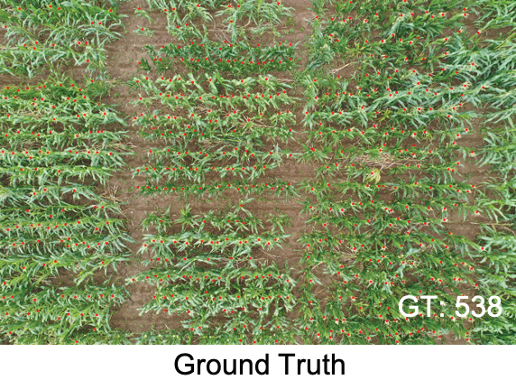
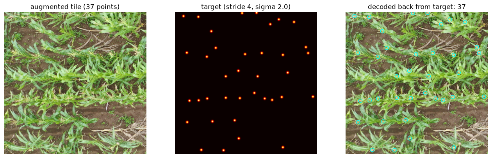
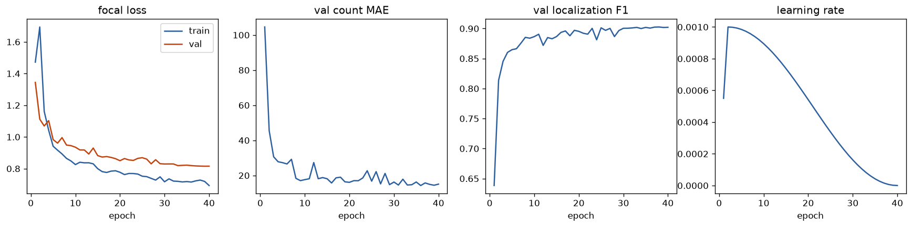
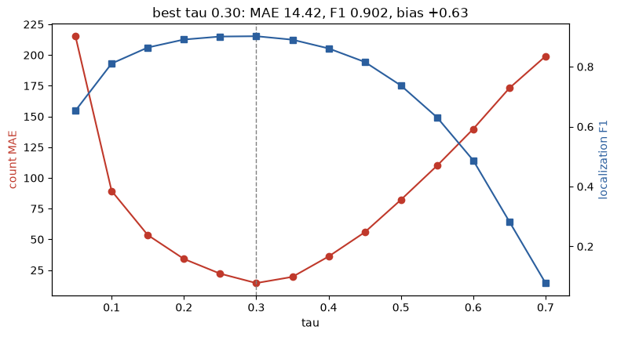
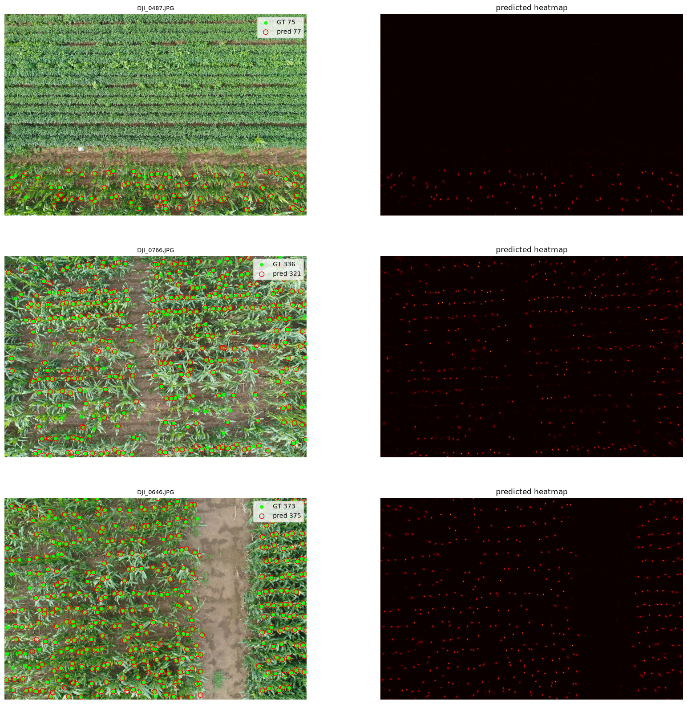
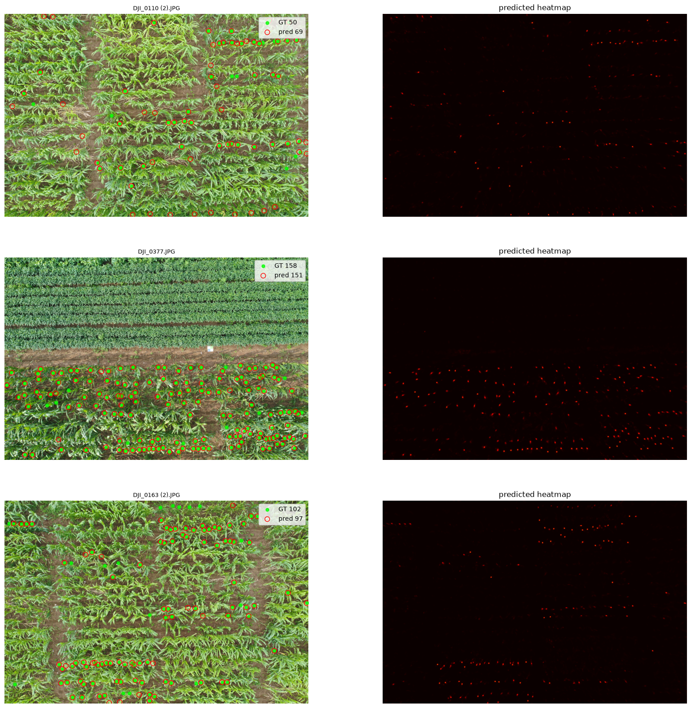
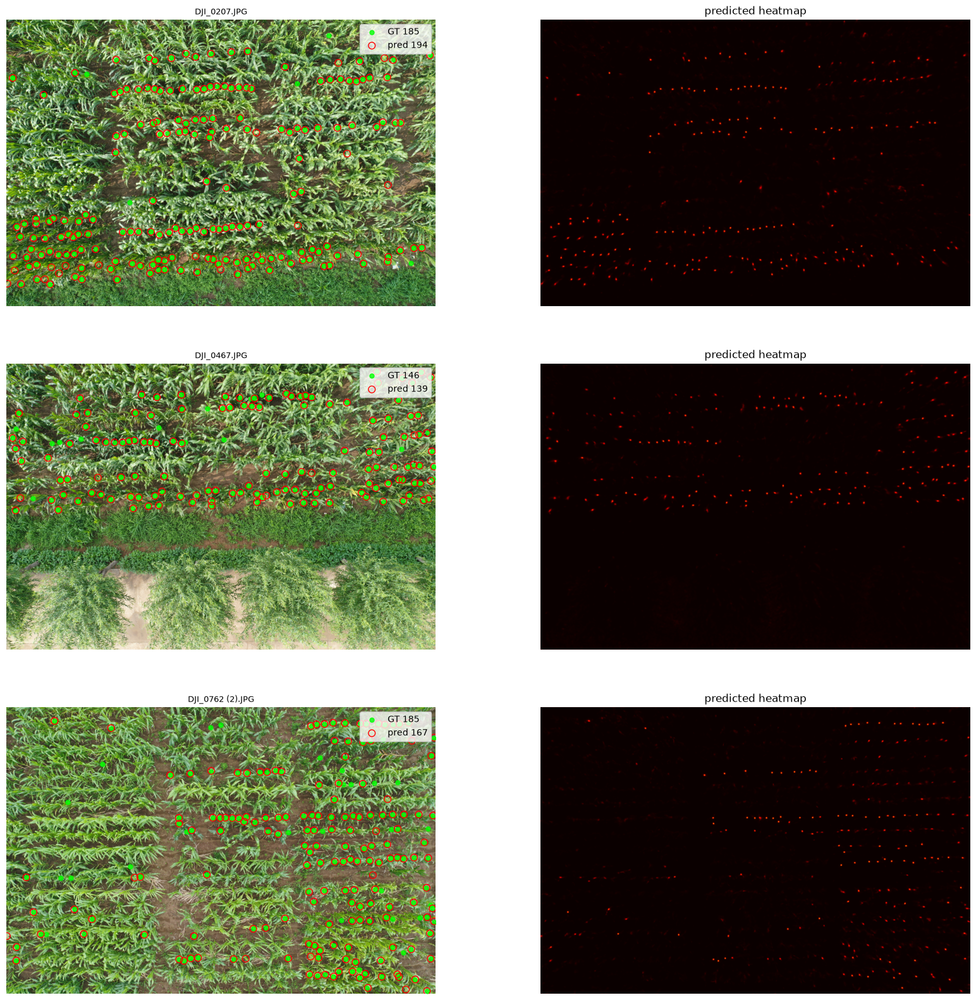
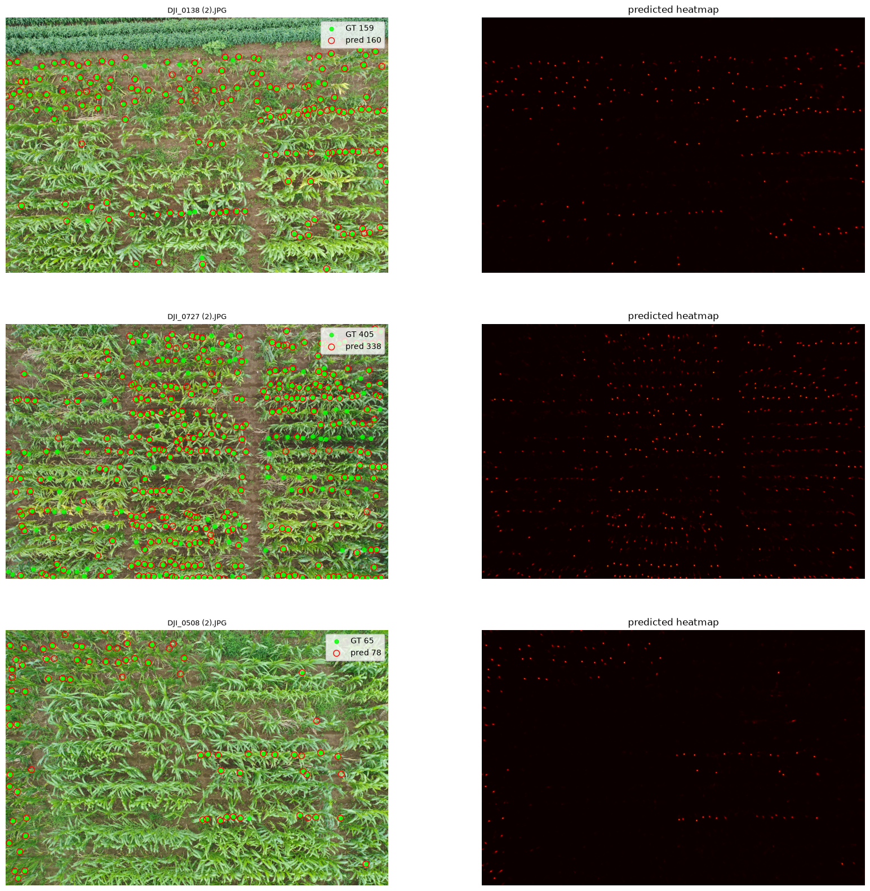

# Maize Tassel Detection

## Applying crop-counter to Maize Tassel Counting MTC-UAV 

## Contents

1. Dataset Context
2. Dataset Acquisition
3. Dataset Reformatting
4. Training
5. Tuning
6. Inference and Results
7. References
8. Appendix

## 1. Dataset Context

The Maize Tassels Counting from Unmanned Aerial Vehicle Dataset (MTC-UAV) consists of 306 images of 5472x3648 pixels, taken from a drone at 12.5m height. 70,870 Maize Tassels have been manually annotated across the set of images.

Figure 1. A sample image from the MTC-UAV dataset (Lu, H. et al. 2022).

Figure 2. A close up view of three Maize Tassels, the objective to locate and count.

## 2. Dataset Acquistion 

The MTC-UAV dataset can be acquired via the google drive link found on their [GitHub Repository](https://github.com/poppinace/mtc-uav/tree/master).

## 3. Dataset Reformatting

Once downloaded and extracted, the dataset must be reformatted to be compatible with crop-counter. This involves:

- Restructuring the directories to contain train/, val/, and test/.
- Storing the point annotations under each split as annotations.xml in CVAT 1.1 format.

These steps are handled by the `1_reformat.ipynb notebook`. Simply change the SRC and DST path variables to your extracted dataset and desired reformat destination.

### Expected Output Table

| Split | Images | Points  | Empty |
| ----- | ------ | ------- | ----- |
| train | 200    | 47,674  | 0     |
| val   | 106    | 21,984  | 0     |

Table 1. Expected number of images, points, and empty labels in each dataset split after reformatting.

## 4. Training

Training is handled by the `2_training.ipynb` notebook. If you are running this yourself you will need to adjust the path to the reformatted dataset root directory in the config, and adjust the relative paths to your DINOv3 ConvNeXt weights and runs directories in the config loading cell. 

The training config uses default parameters with 40 epochs, aside from an increased non-max-suppression `nmd_radius` from 1.5 to 5, which given the distance of Maize Tassels in the imagery, should help to prevent duplicate counts, and;

Due to the larger resolution of the dataset imagery, I decided to use a larger random crop tile size of 1536x1536 pixels, twice the dimensions of the default 768x768 pixels. This does require more GPU VRAM to train, so if you have less than 16GB of VRAM it's recommended to either:

- Lower the batch size.
- Use the smaller 768x768 pixel random crop tiles with more epochs.
- Pre-chunk the dataset imagery as an additional reformatting step.

Though note, chunking or sliding window approaches are not strictly necessary with the crop-counter architecture, as it is fully convolutional and can effectively be applied to images of any size (divisible by its max stride of 32). Though they may be helpful in lower memory environments.

Figure 3. A training tile sample and its Gaussian heatmap target.

The model was trained for 40 epochs over approximately 2 hours on an RTX 4070 Ti Super. The best epoch was epoch 39, suggesting that the model was still improving and would most likely benefit from more epochs.

Figure 4. The 40 epoch run training history.

## 5. Tuning

Tuning is also handled by the `2_training.ipynb` notebook, at its end.

The objective of tuning is to find the best value of `tau`, the confidence threshold for the local max decode head. This is done by sweeping through `tau` values of 0.05 to 0.75 with a step of 0.05 and predicting on the validation set. The best `tau` value will have the highest localisation F1 score and lowest count MAE, which should correspond to the same `tau` value under most circumstances.

Figure 5. Results of the `tau` sweep on the validation set with the best model (epoch 39).

The best `tau` value in Figure 5 is 0.3, which coincidently is the same used in the initial training config.

See Figures 6 to 10 in the appendix for prediction vs ground truth spot checks. 

## 6. Inference and Results

The MTC-UAV dataset splits are only train and validation, there is no dedicated third test set, as such performance metrics are reported on the validation set. As such the results can be taken from the best `tau` sweep in `2_training.ipynb`, though separate inference can also be run in `3_inference.ipynb`.

| Model | MAE | RMSE | Bias | Precision | Recall | F1 |
| ----- | ---- | ---- | ---- | --------- | ------ | -- |
| best epoch 39 | 14.425 | 20.112 | 0.632 | 0.900 | 0.903 | 0.902 |

Table 2. Count error and localisation performance metrics of the best model.

Unfortunately, our model does not beat Lu, H. et al. (2022)'s TasselNetV3 for this task, as they achieved an impressive count MAE of 8.8 and RMSE of 13.5. However, despite producing a heatmap prediction they do not directly localise each counted instance, and as such they do not record localisation metrics to compare with ours, making comparison beyond raw counting performance difficult.

Model results obtained here may be improved with more training time / epochs, using the larger model config, and with a more robust sweep of decode head parameters.

## 7. References

Lu, H. et al. (2022) *Tasselnetv3: explainable plant counting with guided upsampling and background suppression*, IEEE Transactions on Geoscience and Remote Sensing, 60, pp. 1–15. Available at: https://doi.org/10.1109/TGRS.2021.3058962 (Accessed: 20/08/2026)

## 8. Appendix

### Spot Check Visualisations

Figure 6. Model (best epoch 39, `tau` 0.3, `nms_rad` 5) Spot Checks rng 0.

Figure 7. Model (best epoch 39, `tau` 0.3, `nms_rad` 5) Spot Checks rng 1.

Figure 8. Model (best epoch 39, `tau` 0.3, `nms_rad` 5) Spot Checks rng 2.

Figure 9. Model (best epoch 39, `tau` 0.3, `nms_rad` 5) Spot Checks rng 3.