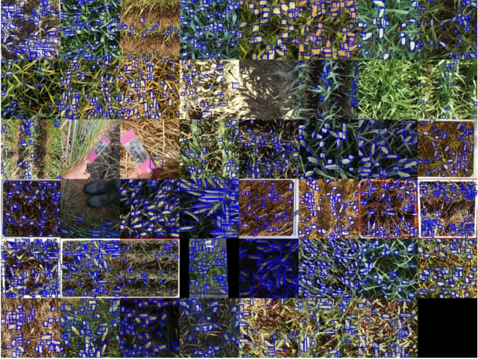
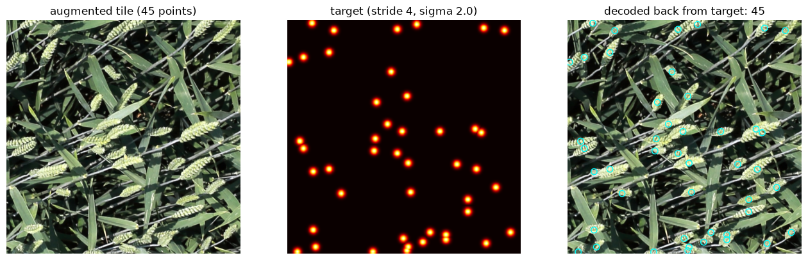
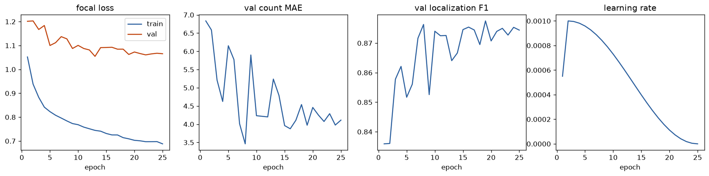
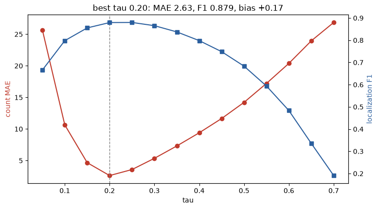
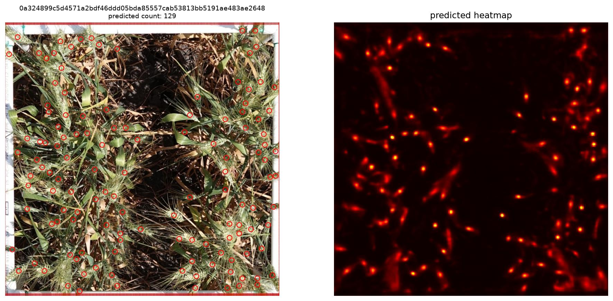
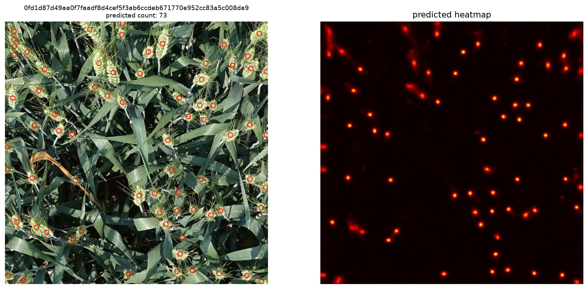
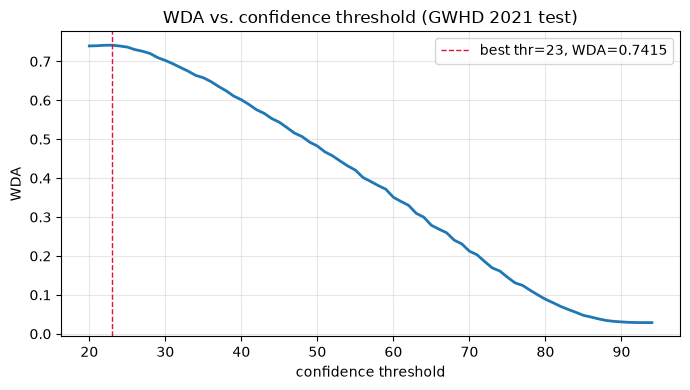
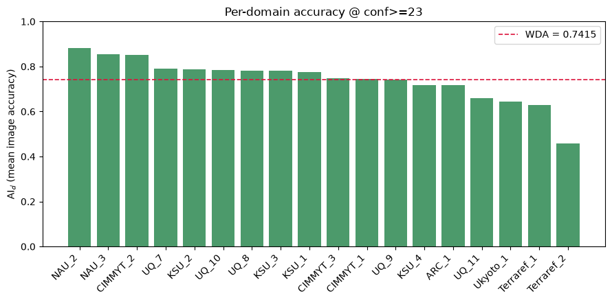

# Wheat Head Detection

## Applying crop-counter to the Global Wheat Head Dataset GWHD_2021


## Contents

1. Dataset Context
2. Dataset Acquisition
3. Dataset Reformatting
4. Training
5. Tuning
6. Test Inference
7. Results
8. References
9. Appendix


## 1. Dataset Context

The Global Wheat Head Dataset is an object detection dataset composed of more than 6000 images from 11 countries, containing over 300,000 labelled instances of wheat heads.

It was created in 2020 and further developed in 2021 by Etienne D, et al. (2021), a link to their paper can be found [here](https://doi.org/10.34133/2021/9846158) and in the references section.



Figure 1. Sample images of the Global Wheat Head Detection 2021 (Etienne D, et al. 2021)

Additionnally, a link to the dataset on [Zenodo](https://zenodo.org/records/5092309) and the AI Crowd [Challenge](https://www.aicrowd.com/challenges/global-wheat-challenge-2021).

# 2. Dataset Acquisition

The dataset can be downloaded via a browser from [Zenodo](https://zenodo.org/records/5092309) or alternatively, much faster via a terminal with a tool like [aria2](https://aria2.github.io/).

```bash
aria2c -x16 -s16 -k1M -c --file-allocation=none --summary-interval=10 -o gwhd_2021.zip "https://zenodo.org/api/records/5092309/files/gwhd_2021.zip/content" > /d/Projects/WheatHead/aria2_download.log
```

Once downloaded it can be extracted to a project `data/` directory.

## 3. Dataset Reformatting

Once downloaded and extracted, the dataset must be reformatted to be compatible with crop-counter. This involves:

- Restructuring the directories to contain `train/`, `val/`, and `test/`.
- Converting the bounding boxes into points via their mid points.
- Storing the point annotations under each split as `annotations.xml` in CVAT 1.1 format.

These steps are handled by the `1_reformat.ipynb` notebook. Simply change the `SRC` and `DST` path variables to your extracted dataset and desired reformat destination.

### Expected Output Table

| Split | Images | Points  | Empty |
| ----- | ------ | ------- | ----- |
| train | 3657   | 163,690 | 50    |
| val   | 1476   | 44,347  | 28    |
| test  | 1382   | 67,431  | 47    |

Table 1. Expected number of images, points, and empty labels in each dataset split after reformatting.


## 4. Training

The parameters for training were mostly left default, which means the training set consists of 768x768 px random crop tiles of 1024x1024 px images, slightly alternating what data is seen each epoch. Training is handled by the `2_training.ipynb` notebook.

To run it yourself, you must adjust the path to the reformatted dataset root directory in the config, and adjust the relative paths to your DINOv3 ConvNeXt weights and runs directories in the config loading cell. 



Figure 2. A training tile sample and its Gaussian heatmap target.

The model was trained for 25 epochs over approximately 3 hours on an RTX 4070 Ti Super. The best epoch, chosen by lowest validation loss corresponding to the best heatmaps, was epoch 13.



Figure 3. The 25 epoch run training history.

The training history in Figure 3 shows the best epoch at epoch 13 with the lowest val loss. The fluctuations in count MAE and localisation F1 are due to being determined by the reference decoding parameters defined in the config. The best decode parameters are tuned in section 5 below.


## 5. Tuning

Tuning is also handled by the `2_training.ipynb` notebook, at its end.

The main point decoding parameter which requires tuning is `tau`, the confidence threshold for the local max decode head. Areas on the heatmap with a probability below `tau` are not considered as point predictions. ``tau`` is tuned by sweeping each value between 0.05 and 0.75 with a step of 0.05 and predicting on the validation set.



Figure 4. Results of the `tau` sweep on the validation set with the best model (epoch 13) and an NMS radius of 5. 

The ideal `tau` has the highest localisation F1 score and lowest count MAE, these metrics should correspond to each other because the best localisation should result in the lowest error count. For both best and last epochs a `tau` of 0.2 was ideal as shown in Figure 4.

Inspecting spot checks showed duplicate points being decoded on some smeared areas. To fix this issue the non-max-suppression radius `nms_radius` was increased from its default of 1.5 to 5. 

| Model | Config | MAE | RMSE | Bias | Precision | Recall | F1 |
| ----- | ------ | ---- | ---- | ---- | --------- | ------ | -- |
| best epoch 13 | NMS 1.5 | 2.937 | 4.594 | 1.189 | 0.853 | 0.887 | 0.870 |
| best epoch 13 | NMS 5 | 2.625 | 4.011 | **0.174** | **0.877** | 0.882 | **0.879** |
| last epoch 25 | NMS 5 | **2.500** | **3.840** | 0.852 | 0.864 | **0.889** | 0.876 |
All use `tau` 0.2 | k 3

Table 2. Model validation metrics at a `tau` of 0.2.

The best and last epochs perform relatively equally, I decided to use the best epoch, but given the last epoch has slightly better count metrics here, you could make the case to use that one instead. See Figures 5 to 8 of the appendix for spot check visualisations.

## 6. Test Inference

To compare our model's performance to those from the 2021 competition, we must first predict on the test set, handled via the `3_inference.ipynb` notebook. To run it yourself, you must adjust the paths to the model checkpoint, dataset test images directory, and desired output directory.

### Example Prediction Visualisations




Figures 9, 10. Sample test set prediction visualisations

## 7. Results

Etienne D, et al. (2021) define their own test performance metric for the dataset called $\mathrm{WDA}$ (Weighted Domain Accuracy) or $\mathrm{ADA}$ (Average Domain Accuracy). Both metrics are the same, ADA was the name used for the metric on the AI Crowd competition.

The accuracy over image $i$ belonging to domain $d$ is

$$\mathrm{AI}_d(i) = \frac{\mathrm{TP}}{\mathrm{TP} + \mathrm{FN} + \mathrm{FP}},$$

where $\mathrm{TP}$, $\mathrm{FN}$, $\mathrm{FP}$ are the numbers of true positives, false
negatives and false positives in image $i$. The **weighted domain accuracy** is the mean of the
per-domain mean accuracies:

$$\mathrm{WDA} = \frac{1}{D}\sum_{d=1}^{D}\; \frac{1}{n_d}\sum_{i=1}^{n_d} \mathrm{AI}_d(i),$$

where $D$ is the number of domains (sub-datasets) and $n_d$ is the number of images in domain $d$.
Note that WDA weights every **domain** equally, regardless of how many images it contains.

### Matching TP / FP / FN

The original GWHD challenge matches predicted **boxes** to ground-truth **boxes** at $\mathrm{IoU}\ge0.5$
with one-to-one greedy assignment. Our model outputs **points**, so we adapt the matching to a
parameter-free **point-in-box** rule against the ground-truth boxes:

* Predictions are considered in **descending confidence** order.
* A predicted point is a **TP** if it falls inside a still-unmatched GT box; that box is then consumed
  (one-to-one). If the point lands inside several unmatched boxes, the one whose centre is nearest is used.
* A predicted point matching no free box is a **FP**.
* Every GT box left unmatched is a **FN**.
* Empty image with no predictions -> $\mathrm{AI}=1$ (the $0/0$ case is defined as a perfect score).

### Evaluation

The calculation of $\mathrm{WDA}$ from the test set inference is handled by the `4_evaluate.ipynb` notebook. To run it yourself change the paths to the predicted XML file points and original bounding boxes CSV file.

Our initial score with with all predictions included was: $\mathrm{WDA} = 0.7396$



Figure 11. $\mathrm{WDA}$ over increasing confidence confidence thresholds.

Tightening the confidence threshold to 0.23 sees slightly higher performance, shown in figure 11: $\mathrm{WDA} = 0.7415$



Figure 12. Accuracy of each domain at a confidence threshold of 23.

Figure 12 shows that most domains perform close to the average with only minor variance, notably some such as `NAU_2` and `NAU_3` perform above average, while the `Terraref_1` and `Terraref_2` domains perform below average.

Compared to the results of [2021 competition submissions](https://www.aicrowd.com/challenges/global-wheat-challenge-2021/leaderboards), our model performs notably better than the best approach of the time, which attained $\mathrm{WDA} = 0.700$, while the runners up attained $\mathrm{WDA} = 0.695$.

## 8. References

Etienne D, et al. (2021) *Global Wheat Head Detection 2021: An Improved Dataset for Benchmarking Wheat Head Detection Methods.* Available at: [https://doi.org/10.34133/2021/9846158](https://doi.org/10.34133/2021/9846158) (Accessed: 20/08/2026)

Etienne D, et al. (2021) *Global Wheat Head Dataset 2021.* Available at: [https://doi.org/10.5281/zenodo.5092309](https://doi.org/10.5281/zenodo.5092309) (Accessed: 20/08/2026)


## 9. Appendix

### Spot Check Visualisations


Figure 5. Model (best epoch 13, `tau` 0.2, `nms_rad` 5) Spot Checks rng 0.


Figure 6. Model (best epoch 13, `tau` 0.2, `nms_rad` 5) Spot Checks rng 1.


Figure 7. Model (best epoch 13, `tau` 0.2, `nms_rad` 5) Spot Checks rng 2.


Figure 8. Model (best epoch 13, `tau` 0.2, `nms_rad` 5) Spot Checks rng 3.

